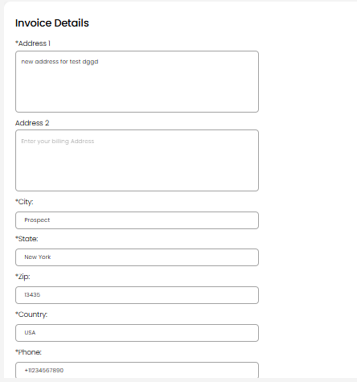
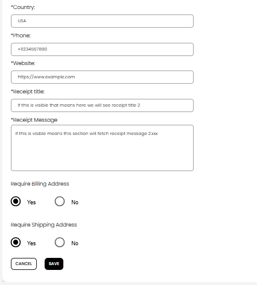

[Auctioneer Misc](./index.md) · [Auction Journal](../../index.md)

# Why should I fill in invoice details? Where are they used?

You should fill in **Invoice Details** so Auction Journal can produce professional **settlement invoices and receipts** for your auctions. This setup is **required before you can create a new auction**—if it is missing, **New Auction** may list **Missing Invoice** under requirements.

---

## What invoice details are for

| What you enter | How it is used |
|----------------|----------------|
| **Address, phone, website** | Your business contact information on file for invoices and receipts (shown on the Invoice Details page after you save). |
| **Receipt title** | The **heading** at the top of **auction settlement invoice PDFs** (buyer and seller settlements). |
| **Receipt message** | Custom text you want associated with your receipts (saved and shown on your Invoice Details summary). |
| **Require billing / shipping address** | Settings for whether billing and shipping addresses are required on settlement paperwork (Yes or No). |

Settlement invoices also use your **auctioneer profile** (company name, logo, and registration address) for the auctioneer block on the PDF. Keep your profile accurate under account settings as well.

---

## Where they are used

- **Auction settlement** — When you generate or download **settlement invoice PDFs** for buyers or sellers after an auction, Auction Journal uses your invoice details (especially the **receipt title**) together with lot totals, premiums, taxes, and payment status.
- **Creating auctions** — Auction Journal checks that invoice details exist before allowing most new auctions.

---

## How to fill in invoice details

### Step 1 — Open Invoice Details

1. Sign in to the **Auctioneer Dashboard**.
2. Open **Miscellaneous**.
3. Select **Invoice Details**.

Route: **Miscellaneous → Invoice Details** (`/dashboard/miscellaneous/invoices`).

### Step 2 — Enter address and contact

If you have not saved before, the form opens automatically. Required fields are marked with **\***.

1. **Address 1** — Primary business address (required).
2. **Address 2** — Optional second line.
3. **City**, **State**, **Zip** — Enter a valid U.S. **Zip**; city and state may fill automatically.
4. **Country** — Usually **USA** (read-only after zip lookup).
5. **Phone** — U.S. format with country code, e.g. **+11234567890** (required).
6. **Website** — Your business website (required).

### Step 3 — Receipt text and options

1. **Receipt title** — Short title printed at the top of settlement invoices (required).
2. **Receipt message** — Longer message or terms you want on file for receipts (required).
3. **Require Billing Address** — **Yes** or **No**.
4. **Require Shipping Address** — **Yes** or **No**.
5. Select **SAVE**.

### Step 4 — Review or edit later

After saving, the page shows a summary (address, phone, website, receipt title, receipt message). Select **Edit** to change any field and **SAVE** again.

---

## Before you create an auction

Complete invoice details along with other Miscellaneous setup:

- [Formulas](formulas.md) (commission, buyer premium, taxes)
- [Accounts](account.md)
- [Stripe Connect](../auctioneeer/stripe-connect.md)
- At least one **seller** (client)

---

## Related topics

- [Formulas](formulas.md)
- [Accounts](account.md)
- [Stripe Connect](../auctioneeer/stripe-connect.md)
- Auction settlement guides — see [sample questions](../sample_questions.md)
