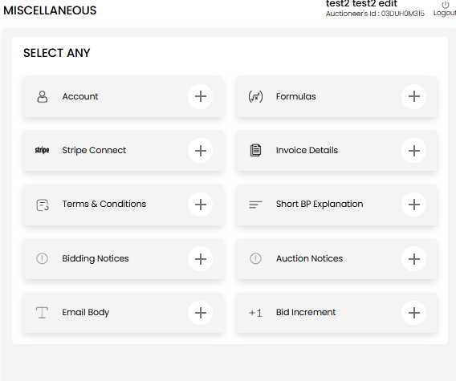

[Auctioneer Misc](./index.md) · [Auction Journal](../../index.md)

# Why should I create templates in advance? What types can I create, and where are they used?

**Templates** are saved snippets you reuse when you **create or edit an auction**—standard terms, notices, registration emails, and bid-increment ladders. You can build them ahead of time under **Miscellaneous**, or save wording from an auction while you are setting it up.

When you **use** a template, Auction Journal **fills the auction field** with that text or increment table. After you save the auction, that copy lives on **the auction itself**. If you later **edit or delete** the template in Miscellaneous, **auctions you already saved are not changed**.

---

## Why create templates in advance?

| Benefit | What it means for you |
|---------|------------------------|
| **Faster new auctions** | Pick a saved block instead of retyping the same terms or notices. |
| **Consistency** | Every sale can start from the same buyer-premium explanation or bidding notice. |
| **Build as you go** | While creating an auction, use **Save as Template** to store good wording for next time. |
| **Safe to maintain** | Updating a template only affects **future** uses; it does not rewrite old auctions. |

Templates work alongside other Miscellaneous setup such as [formulas](formulas.md), [accounts](account.md), and [invoice details](invoice-details.md).

---

## Template types and where they are used

| Template (Miscellaneous tile) | Used when building an auction | What bidders may see |
|------------------------------|------------------------------|----------------------|
| **Terms & Conditions** | Auction **Details** — Terms & Conditions | Terms on the auction page and during registration |
| **Short BP Explanation** | Auction **Details** — Short BP Explanation | Buyer-premium explanation on the auction page |
| **Bidding Notices** | **Notices** — Bidding Notice | Bidding notice on auction cards / detail where shown |
| **Auction Notices** | **Notices** — Auction Notice | General auction notice on the sale |
| **Email Body** | **Registration** — Email Subject and Email Body | Email sent around bidder registration for that auction |
| **Bid Increment** | **Bid Increment** section | How bid amounts step up during the sale (based on what you saved on the auction) |

---

## Manage templates under Miscellaneous

1. Sign in to the **Auctioneer Dashboard**.
2. Open **Miscellaneous**.
3. Under **Select any**, choose the template tile you want to manage:

| Tile | What you manage |
|------|-----------------|
| **Terms & Conditions** | Reusable auction terms text |
| **Short BP Explanation** | Buyer’s premium explanations |
| **Bidding Notices** | Bidding notice copy |
| **Auction Notices** | General auction notices |
| **Email Body** | Registration email subject and body |
| **Bid Increment** | Bid increment ladder tables |

Other tiles on the same screen (Account, Formulas, Stripe Connect, Invoice Details) are separate setup—see [accounts](account.md), [formulas](formulas.md), [Stripe Connect](../auctioneeer/stripe-connect.md), and [invoice details](invoice-details.md).

4. On the template page for that tile:
   - **Create New** (or **New Increment** for bid increments) — enter a **title** and the text or increment rows.
   - **Edit** or **Delete** on an existing row.

You can keep **multiple** templates per type (for example “Farm equipment terms” vs “General estate terms”).

---

## Use templates while creating or editing an auction

### Apply a saved template

1. Open the auction build screen and go to the section in the table above.
2. Next to the field, open the template control (**template icon** for text fields, or **Select from template** for bid increments).
3. Preview a template and choose **Use Template** — the field fills with that content. You can still edit before saving the auction.

### Save current text as a new template

1. Type or edit the field in the auction (terms, notice, email, or bid increments).
2. When the content changes, **Save as Template** appears.
3. Select it to add a new entry to your library (Auction Journal will not save an exact duplicate twice).

---

## Edit or delete later

- **Edit** — Changes the saved template for the next time you select it.
- **Delete** — Removes it from your list; it does not remove text already stored on auctions you created earlier.

---

## Related guides

- [Formulas](formulas.md) — commission and tax calculations (separate from text templates)
- [Invoice details](invoice-details.md) — settlement paperwork setup
