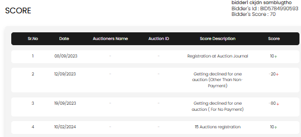

[Auction Journal](../index.md) · [Bidder Score](./index.md)

# Bidder score — what it is, how to view it, and how to improve it

This guide answers the main questions about **bidder score** in Auction Journal. Your score is a number on your bidder account that reflects trust built from your activity on the platform.

---

## What is bidder score? How does it affect me?

**Bidder score** is a running total (between **-100** and **100**) on your Auction Journal **bidder** profile. It goes up when you do things that show reliability, and down when auctioneers or the system record serious problems (especially around payment or declined registrations).

### Why it exists

Auctioneers use bidder score as a **trust signal** when deciding whether to approve your registration to bid at their auctions. A stronger score can help auctioneers feel confident letting you participate.

### How it can affect you

| Your score | Typical effect |
|------------|----------------|
| **Positive** (for example 10, 50, 70) | Normal path when registering for auctions; registration is more likely to be **approved** automatically when the auction uses default rules |
| **Negative** (below 0, shown in **red** in the dashboard) | Some auction registrations may be held **pending** for auctioneer review instead of approved right away |
| **Large drops** (for example after **no payment** or **declined for non-payment**) | Strong signal to auctioneers; may limit how quickly you are approved for new sales |

Score is **informational** for auctioneers today—it is one factor among registration rules, verification, and each auctioneer’s bid-permission settings. It does not replace paying for won lots or following auction terms.

### Examples of score changes (from your history)

| Score description (examples) | Direction |
|------------------------------|-----------|
| Registration at Auction Journal | Increase |
| Becoming Verified Bidder | Increase |
| 15 Auctions registration | Increase |
| Getting declined for one auction (Other Than Non-Payment) | Decrease |
| Getting declined for one auction (For No Payment) | Larger decrease |
| No payment at settlement / chargeback | Large decrease |

Exact point values are set by Auction Journal and appear on each line in your history.

---

## How do I view my score? Can I do anything about my score history?

### Where to see your current score

1. Sign in to the **Bidder Dashboard** on [auctionjournal.com](https://auctionjournal.com).  
2. Your **Bidder’s Score** appears at the top of bidder pages (next to your name and **Bidder’s Id**).  
3. If the score is **negative**, it is highlighted in **red**.

### Where to see score history

1. In the bidder menu, open **Score History** (`/bidder/score-history`).  
2. The page title is **Score**.

The table includes:

| Column | Meaning |
|--------|---------|
| **Sr.No** | Row number |
| **Date** | When the event was recorded |
| **Auctioneers Name** | Auctioneer linked to the event, if any (may show **-** when not tied to one sale) |
| **Auction ID** | Auction linked to the event, if any |
| **Score Description** | What happened (plain-language reason) |
| **Score** | Points for that event — **up** arrow (green) for increases, **down** arrow (red) for decreases |

If you have many entries, use pagination and **show total logs per page** at the bottom.

### Can you change or delete history?

**No.** Score history is a **read-only** log for transparency. You cannot edit, remove, or dispute entries in the dashboard. The list shows active events (some internal reversals may cancel a past line from your visible total when an auctioneer changes a decline to an approval).

If you believe an entry is wrong, contact **Help and Support** from the bidder menu and explain the **date** and **Score Description** shown.

---

## What can I do to improve my score? How can I avoid losing score?

### Ways to build score (improve)

| Action | Why it helps |
|--------|----------------|
| **Complete bidder registration** | You receive credit for registering on Auction Journal |
| **Become a [verified bidder](../bidder/verification.md)** | Verification adds a substantial positive entry |
| **Register for auctions and participate steadily** | Bonus when you reach milestones (for example every **15** auction registrations) |
| **Pay for won items on time** | Positive entries tied to paying at settlement (including milestones for paying on multiple items) |
| **Pick up lots** when required | Avoid “no show” penalties |

There is no manual “add points” button—points are added automatically when the system records these events.

### How to avoid losing score

| Avoid | Typical score impact |
|-------|----------------------|
| **Not paying** for won lots at settlement | Large decrease |
| **Chargebacks** after payment | Large decrease |
| **No show** for lot pickup | Decrease |
| Being **declined** for an auction because of **non-payment** | Large decrease for that auction (or permanently, if an auctioneer sets permanent decline for non-payment) |
| Being **declined** for other serious reasons (difficult bidder, bad check, etc.) | Decrease; permanent declines cost more than a single-auction decline |

### Habits that protect your score

- Register only for auctions you intend to complete.  
- Keep a valid **payment method** on file for verified-bidder auctions.  
- Pay invoices/settlements promptly after you win.  
- Communicate with the auctioneer if you cannot pick up or pay—do not simply no-show.  
- Follow each auction’s rules and your registration approval status.

Recovering from a large drop takes time: future positive events (verification, registrations, on-time payments) add points back within the **-100 to 100** cap.

---

## Related

- [How to become a verified bidder?](../bidder/verification.md)  
- [Is verification mandatory? Benefits?](verification-required.md)  
- [Bidder dashboard](../bidder/dashboard.md)  
- [Questions — Bidder Score](../sample_questions.md#bidder-score)
