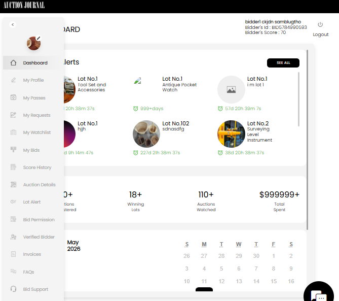

[Bidder](./index.md) · [Auction Journal](../../index.md)

# How do I use the Bidder Dashboard?

The **Bidder Dashboard** is where you sign in after [bidder registration](registration.md) to track **alerts**, **bids**, **registrations**, and your account. Auctioneers use a **different** login and dashboard to run sales.

If you are new, read [Who is a bidder?](role.md), then register and complete [verified bidder](verification.md) setup when auctions require it.

---

## Sign in

1. On the public Auction Journal site, open **bidder sign-in** (not the auctioneer login).
2. Enter your **email** and **password**.
3. You are taken to the bidder area, usually starting on **Dashboard** (`/bidder/dashboard`).

The top of the page shows your **name**, **Bidder's Id**, **Bidder's Score**, and **Logout**. On a phone, use the **menu** icon to open the same links as the sidebar.

---

## Layout at a glance

| Area | What it is for |
|------|----------------|
| **Header** | Auction Journal logo; your bidder details and logout. |
| **Sidebar (left)** | Main menu on desktop. Hover or expand to read labels. |
| **Profile photo (sidebar)** | Pencil icon to upload or change your photo. |
| **Main panel** | The page for the menu item you selected. |
| **Chat icon (bottom right)** | Help on many pages. |



*Example: **Dashboard** home — **Lot Alerts**, summary counts, and calendar.*

---

## Dashboard home — what you see first

When **Dashboard** is selected, the main area typically includes:

| Section | What it shows |
|---------|----------------|
| **Lot Alerts** | Lots you are watching or that need attention, with time remaining. Select **SEE ALL** to open full **Lot Alert** settings and lists. |
| **Summary counts** | Quick totals such as **Auctions Registered**, **Winning Lots**, **Auctions Watched**, and **Total Spent** (amounts may show rounded values like `18+` or `$999999+` when large). |
| **Calendar** | A month view of auction activity tied to your participation. |
| **Shortcuts** | Links toward bids, watchlist, and related areas (layout may vary slightly by screen size). |

To browse and register for sales on the **public** catalog, leave the dashboard and use the main Auction Journal site header and search—not only this home screen.

---

## Sidebar menu — where to go

| Menu | What you do there |
|------|-------------------|
| **Dashboard** | Home overview: lot alerts, counts, calendar. |
| **My Profile** | Edit name, address, phone; change password ([profile](profile.md)). |
| **My Passes** | Listing **bid passes** you generated on **OnSite Auction** listings ([registered listings](../listing/registered-listings.md)). |
| **My Requests** | Listing **callback requests** you sent on other listing types ([registered listings](../listing/registered-listings.md)). |
| **My Watchlist** | Lots you saved to follow. |
| **My Bids** | History of bids you placed. |
| **Score History** | Log of changes to your **bidder score** (shown in the header). |
| **Auction Details** | Auctions you registered for and related detail. |
| **Lot Alert** | Manage lot alert rules and see alert lists (**SEE ALL** from Dashboard). |
| **Bid Permission** | View approval status and limits auctioneers set for you to bid. |
| **Verified Bidder** | Complete or manage verification (card + ID) ([verification](verification.md)). |
| **Invoices** | Settlement or invoice documents when available for your purchases. |
| **FAQs** | Bidder frequently asked questions. |
| **Bid Support** | Get help — callback, email, and ticket history ([Help and Support](../help-and-support/index.md)). |

---

## Typical bidder workflow

```text
Register → (Verified Bidder if required) → browse auctions on public site →
register for an auction → bid on lots → track on Dashboard / My Bids / Watchlist
```

| Step | Where |
|------|--------|
| 1 | [Register](registration.md) — free ([cost](cost.md)). |
| 2 | **Verified Bidder** when the auction requires it ([verification-required](verification-required.md)). |
| 3 | Public site — find auctions and lots; register per sale. |
| 4 | **My Bids**, **My Watchlist**, **Lot Alerts** — follow activity after you bid. |
| 5 | **Bid Permission** — confirm you are approved to bid when an auctioneer must approve you. |
| 6 | **Invoices** — review paperwork after you win, when settlements are issued. |

---

## Public site vs Bidder Dashboard

| Area | Use it to |
|------|-----------|
| **Public Auction Journal** | Search auctions and lots, read terms, register, and place bids. |
| **Bidder Dashboard** | Manage your account, see your score, alerts, bids, permissions, and support tickets. |

---

## Related guides

- [Who is a bidder?](role.md)
- [Registration](registration.md)
- [Forgot password](forgot-password.md)
- [Verified bidder](verification.md)
- [Help and Support](../help-and-support/index.md)
