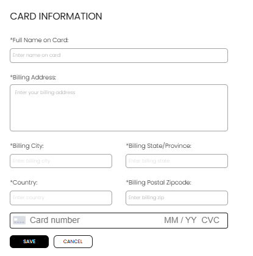
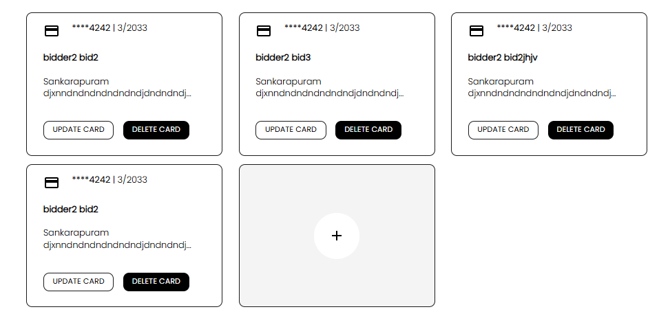

[Bidder](./index.md) · [Auction Journal](../../index.md)

# Why should a bidder add card details in Auction Journal? How do I add them? Is it safe?

Adding card details helps you complete verified bidder steps, participate in more auctions, and lets auctioneers collect eligible payments during transaction flows.

## Why you should add card details

- It is part of becoming a **verified bidder** on `/bidder/verification`.
- Verified bidders can participate more smoothly in auctions that require verified status.
- Your saved card/payment setup supports payment collection steps when required by auction rules.

## How to add card details

1. Open **Verified Bidder** page:
   - `/bidder/verification`
2. In Step 1 (payment details), select the **+** card tile if needed.
3. Fill in:
   - Full Name on Card
   - Billing Address
   - Billing City
   - Billing State/Province
   - Country
   - Billing Postal Zipcode
   - Card Number, Expiry, CVC
4. Select **Save** (or equivalent save-and-proceed button).
5. Continue Step 2 identity upload to finish full bidder verification.

*Card information form used during bidder verification step 1.*

After saving, your card appears in the saved cards section where you can manage it.

*Saved cards view showing update/delete actions and add-card (+) option.*

## Is it safe?

- Card details are processed through Stripe-secured payment flow.
- Auction Journal does not rely on storing raw card numbers directly in the app database.
- You can manage cards later (update/delete) from the same verification/payment area.

## Related

- [How to become verified bidder?](verification.md)
- [Is it mandatory to become a verified bidder? What are the benefits of verification?](verification-required.md)
