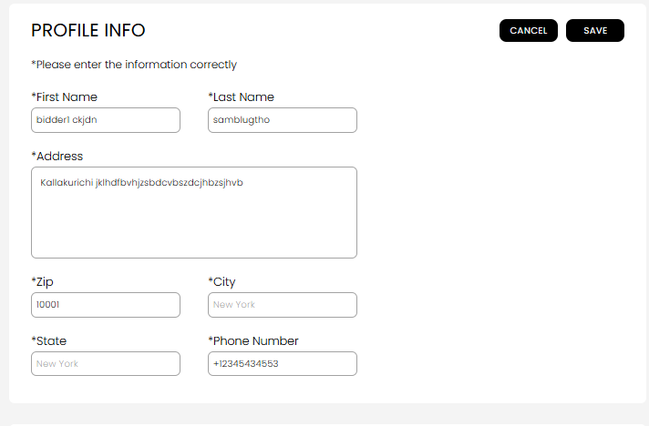

[Bidder](./index.md) · [Auction Journal](../../index.md)

# How can I update my profile details? Which fields can I update?

After you sign in to the **bidder dashboard**, open **My Profile** to update your contact details or password. Your **profile picture** is changed from the **photo on the sidebar** (or mobile menu), not on the main profile form.

---

## Open My Profile

1. Sign in to Auction Journal as a **bidder**.
2. In the bidder menu, select **My Profile**.
3. The page title is **MY PROFILE**. You will see **PROFILE INFO** and **ACCOUNT INFO**.

---

## PROFILE INFO — what you can edit

1. Under **PROFILE INFO**, select **EDIT PROFILE**.
2. Change the fields below, then select **SAVE** (or **Cancel** to discard).

| Field | Required? | Notes |
|--------|-----------|--------|
| **First Name** | Yes | |
| **Last Name** | Yes | |
| **Address** | Yes | Street / mailing line (large text box) |
| **Zip** | Yes | Enter a valid ZIP; **City** and **State** usually fill in automatically |
| **City** | Yes | Filled from ZIP; you typically do not type this separately |
| **State** | Yes | Filled from ZIP; you typically do not type this separately |
| **Phone Number** | Yes | Your contact number on file |

*Edit mode: required fields marked with **\***, **Cancel** and **SAVE** at the top (and **Save** on mobile).*

3. When save succeeds, you will see a success message and return to view mode.

---

## ACCOUNT INFO — email and password

| Item | Can you change it here? |
|------|-------------------------|
| **Email** | **No** — shown for reference only (set when you registered). |
| **Password** | **Yes** — select **Change Password**, enter **old password**, **new password**, and **re-enter new password**, then **save**. |

New password rules: at least **8 characters** with **uppercase**, **lowercase**, a **number**, and a **special character**. You may receive a confirmation email after a successful change.

If you forgot your password, use [forgot password](forgot-password.md) instead of this screen.

---

## Profile picture (sidebar)

1. Select the **pencil icon** on your avatar in the **sidebar** (or mobile header).
2. **Upload** or **Change Profile Picture**, or **Remove Profile Picture**.

ID verification documents are **not** updated here — use **[Verified Bidder](verification.md)** for Driving Licence / State ID.

---

## What is not on My Profile

| Item | Where to manage it |
|------|---------------------|
| **Government ID** (for verified bidder) | [Verified Bidder](verification.md) |
| **Payment cards** | [Verified Bidder](verification.md) (after verification) or auction registration when prompted |
| **Email address** | Set at [registration](registration.md); contact support if it must change |

---

## Related guides

- [Registration](registration.md)
- [Verified bidder](verification.md)
- [Help and Support](../help-and-support/index.md)
