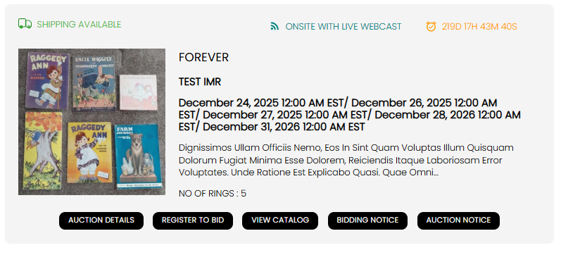
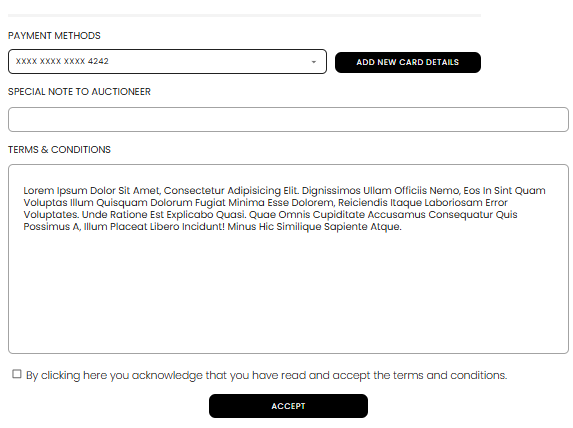

[Bidder](./index.md) · [Auction Journal](../index.md)

# How do I register for an auction?

**Registering for an auction** means signing up to bid on **that specific sale**—separate from creating your Auction Journal **bidder account**. You register from the **public auction page** while the auction is open for registration.

---

## Before you register

| Requirement | Why |
|-------------|-----|
| **Bidder account** | [Register in Auction Journal](registration.md) and sign in. |
| **ID on file** | Upload **Driving Licence / State ID** when prompted (registered bidder path). |
| **Verified bidder** (if the auction requires it) | Some sales only allow **Verified Bidder** registration—you need ID **and** a card on file. See [Become a verified bidder](verification.md). |
| **Registration window open** | Registration is only available between the auction’s **start** and **end** dates shown on the listing. |

If you are not signed in, selecting **Register to bid** opens **login** first, then continues the flow.

---

## Step 1 — Find the auction and start registration

1. Browse auctions on Auction Journal ([search for auctions](search-auctions.md) or open a catalog from an auctioneer site).
2. On the auction card or detail area, select **REGISTER TO BID** (or **Register to bid**).

The button may also appear as **Register to Bid** on detail views. Other buttons on the card (**Auction details**, **View catalog**, notices) do not complete registration.

### If the site blocks you before the form

| Message / prompt | What to do |
|------------------|------------|
| **Login** popup | Sign in with your bidder email and password. |
| **Upload ID** | Add front and back of your licence or state ID (one-time for registered bidder access). |
| **Become a verified bidder** | The auction requires verified registration—complete [verification](verification.md) (card + ID). |

---

## Step 2 — Complete the registration form

When you qualify, the **Auction Registration** popup opens. Your name, address, phone, and email are shown from your bidder profile.

| Section | What to do |
|---------|------------|
| **Payment methods** | Shown only when the auction uses **Verified Bidder** registration. **Select** a saved card from the list, or **Add new card details**. |
| **Special note to auctioneer** | Optional—explain anything the auctioneer should know. |
| **Terms & conditions** | Read the auction’s terms (set by the auctioneer) and check **By clicking here you acknowledge…** |
| **Accept** | Submit registration. You must check terms first; otherwise you see an error. |

**Registered Bidder** auctions do not show the payment section; you still accept terms and select **Accept**.

---

## Step 3 — Understand the result

After you submit, you see one of these outcomes:

| Result | What it means |
|--------|----------------|
| **Success — registered** | You are **approved** for this auction (up to the bid limit shown). You can bid when bidding opens for that sale. |
| **Registration is pending** | The auctioneer must **approve** you before you can bid. Contact them if needed. |
| **Registration declined** | You cannot bid this auction. The message may ask you to contact the auctioneer about bid permission. |

Approval rules depend on your **bidder score** and whether the auctioneer has preset permission on your customer record. Auctioneers can change status later from their dashboard.

If you are **pending** or **declined**, see [Why was my registration rejected or still pending?](registration-rejected-or-pending.md).

You receive an **email** about the outcome when registration completes or is updated.

---

## Rules to remember

- **One registration per auction** — After you register once (any status), you cannot submit the form again for the same sale. If something should change, contact the **auctioneer**.
- **Registration ≠ bidding** — Registering only gives permission to bid when that auction’s bidding is open.
- **Card on file** — For verified-bidder auctions, keep a valid card saved under your bidder account ([payment method](payment-method.md)).

---

## Related

- [Register as a bidder on Auction Journal](registration.md)
- [Become a verified bidder](verification.md)
- [Is verification mandatory? Benefits](verification-required.md)
- [Search for auctions](search-auctions.md)
- [Search for auction lots](search-auction-lots.md)
- [Why was my registration rejected or still pending?](registration-rejected-or-pending.md)
- Auctioneer view of your registration: [Registration acceptance](../auction/registration-acceptance.md) (how approval works on their side)
