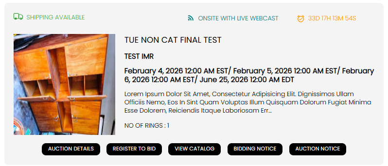
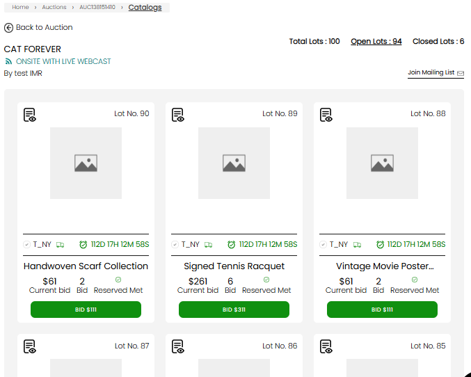
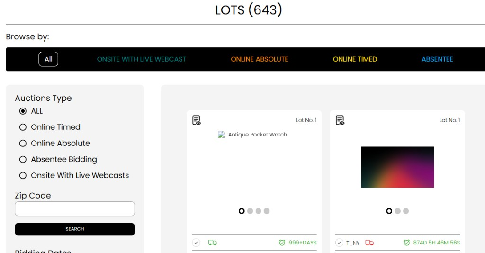

[Auction Journal](../index.md) · [Bidder](./index.md)

# How do I search for auction lots in Auction Journal?

You can browse **lots** (individual items for bid) in two main ways on [auctionjournal.com](https://auctionjournal.com):

1. **Inside one auction** — open that sale and use **View Catalog**.
2. **Across all auctions** — use the site-wide **LOTS** search at [auctionjournal.com/auctions/search-by-lots](https://auctionjournal.com/auctions/search-by-lots).

You do **not** need to sign in to browse lots. Sign in as a **bidder** when you want to register, bid, or see your bid status on cards.

A **lot** is one line in an auction catalog. An **auction** is the full sale. To find sales first, see [How do I search for auctions in Auction Journal?](search-auctions.md).

---

## Path 1 — Lots in one auction (View Catalog)

Best when you already know which auction you care about.

1. Find the auction using [search auctions](search-auctions.md) (by state, calendar, auctioneer, **FIND AUCTIONS** shortcuts, and so on).
2. On the auction card or auction details page, click **View Catalog**.

3. You land on that auction’s **catalog** page (URL pattern: `/auctions/{auctionId}/catalogues`).

On the catalog you typically see:

| Element | What it does |
|---------|----------------|
| **Back to Auction** | Return to the auction summary |
| **Total / Open / Closed lots** | Counts and tabs to focus on lots still open for bidding vs closed |
| **Search** | Search by lot **title**, **lot number**, or keyword within this auction only |
| **Sort** | Order by bids, bid amount, lot number, sale order, watchlist, and similar |
| **Lot category** filter | Limit to categories used in this auction |
| **Lot cards** | Image, title, current bid, time left, **Bid** (when bidding is open) |

Click a lot card to open the **lot detail** page for photos, description, and bidding.

---

## Path 2 — Lots across all auctions (search-by-lots)

Best when you want to scan **open lots** from many sales at once (by type, category, or keyword).

### Open the page

Use any of these:

| Entry | URL |
|-------|-----|
| Direct link | [auctionjournal.com/auctions/search-by-lots](https://auctionjournal.com/auctions/search-by-lots) |
| **FIND AUCTIONS** menu → **By Lots** | Same page |
| From an auctions browse page — **Lot Category** sidebar search (when categories are selected) | Opens **search-by-lots** with category filters in the URL |

The heading shows **LOTS** and a total count, for example **LOTS (643)**.

### Browse by auction type

Under **Browse by:**, pick a strip such as **All**, **ONSITE WITH LIVE WEBCAST**, **ONLINE ABSOLUTE**, **ONLINE TIMED**, or **ABSENTEE**. The list refreshes to lots from sales of that type.

### Left sidebar filters

On desktop, the left column includes:

| Filter | What it does on this page |
|--------|---------------------------|
| **Auctions Type** | Radio list (All, Online Timed, Online Absolute, Absentee, Onsite With Live Webcasts) — same idea as the type strip |
| **Zip Code** | Enter ZIP and **Search** — takes you to the **auctions** browse page with location filters (find nearby **auctions**, then use **View Catalog** on a sale) |
| **Bidding Dates** | **From** / **To** dates and **Search** — filters the **auctions** browse view by bidding window |
| **Lot Category** | Check one or more categories and **Search** — stays on **search-by-lots** and shows lots in those categories |
| **Auctioneer** | Check auctioneer names and **Search** — opens the **auctions** list filtered by those companies |

So **lot category** and the **Browse by** type bar filter **lots** on this page. **ZIP**, **bidding dates**, and **auctioneer** checks on this sidebar jump to **auction-level** results; from there, open **View Catalog** on any auction to see its lots.

### Top search bar

The **Search For :** bar (State, City, ZIP, Miles, Lot Category, Keyword) appears at the top of many browse pages. When you are already on **search-by-lots**, use the **sidebar** and **Browse by** controls above for lot-focused filters. The top bar is shared with [auction search](search-auctions.md) and is oriented toward finding **auctions** when submitted from that control.

### Results and pagination

- Lots appear as **cards** (often two per row on desktop) with auction context, countdown, and bid information.
- Use **pagination** and **show total lots in page** at the bottom when there are many results.
- If you are signed in, the site can show whether you are winning or outbid on a lot.

---

## Quick comparison

| Goal | Start here |
|------|------------|
| All lots in **one** known auction | That auction → **View Catalog** |
| Lots **everywhere** by type or category | [search-by-lots](https://auctionjournal.com/auctions/search-by-lots) |
| Find sales near a ZIP or date first | [Search auctions](search-auctions.md), then **View Catalog** |
| Promotional event pages (not live catalog) | [Search listings](../listing/search-listings.md) |

---

## After you find a lot

1. Open the lot for full details and photos.
2. **Register to Bid** on the parent auction if registration is required and you are not already approved.
3. Place bids according to the auction type (timed online, live webcast, absentee, and so on).

Registration: see [sample questions](../sample_questions.md) under **Auction Registration** when that guide is published.

---

## Related

- [How do I search for auctions in Auction Journal?](search-auctions.md)
- [Search listings](../listing/search-listings.md)
- [Auction types](../auction/auction-types.md)
- [Bidder registration](registration.md)
