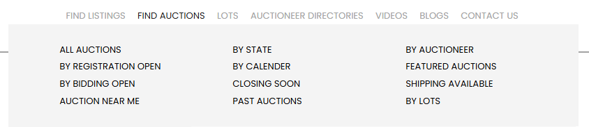
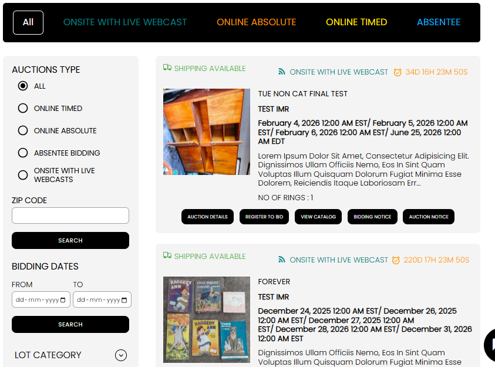
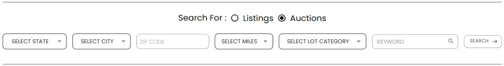

[Auction Journal](../index.md) · [Bidder](./index.md)

# How do I search for auctions in Auction Journal?

Anyone can search **auctions** on the public website [auctionjournal.com](https://auctionjournal.com)—you do **not** need to sign in to browse. An **auction** is the live sale on Auction Journal (timed online bidding, onsite live webcast, and so on). That is different from a **listing**, which is promotional information about an upcoming event.

---

## Quick paths

| Goal | Where to go |
|------|-------------|
| Browse all published auctions | [auctionjournal.com/auctions?all-auctions=true](https://auctionjournal.com/auctions?all-auctions=true) |
| Pick a US state on the map | [auctionjournal.com/auctions/find?by-state=true](https://auctionjournal.com/auctions/find?by-state=true) |
| Pick a date on the calendar | [auctionjournal.com/auctions/find?by-calender=true](https://auctionjournal.com/auctions/find?by-calender=true) |
| Find an auctioneer, then their auctions | [auctionjournal.com/auctioneer/search-by-map](https://auctionjournal.com/auctioneer/search-by-map) |
| Filter bar (state, city, ZIP, miles, category, keyword) | [auctionjournal.com/auctions](https://auctionjournal.com/auctions) with query parameters, or the same bar on the [home page](https://auctionjournal.com) |

---

## 1. FIND AUCTIONS menu

1. Open [auctionjournal.com](https://auctionjournal.com).
2. In the top menu, hover or open **FIND AUCTIONS**.

Common links:

| Menu item | URL (examples) |
|-----------|----------------|
| **All Auctions** | `/auctions?all-auctions=true` |
| **By State** | `/auctions/find?by-state=true` |
| **By Calender** | `/auctions/find?by-calender=true` |
| **By Auctioneer** | `/auctions/auctioneer` (auctioneer list) or start from the [auctioneer map](https://auctionjournal.com/auctioneer/search-by-map) |
| **By Registration Open** | `/auctions?registration-open=true` |
| **By Bidding Open** | `/auctions?bidding-open=true` |
| **Closing Soon** | `/auctions?soft-close=true` |
| **Past Auctions** | `/auctions?closed=true` |
| **Featured Auctions** | `/auctions?featured=true` |
| **Shipping Available** | `/auctions?shipping=true` |
| **Auction Near Me** | `/auctions?near-me=true&miles=100` |
| **By Lots** | `/auctions/search-by-lots` |

Each link opens the auctions browse experience with filters already applied.

---

## 2. All auctions

Go to [All Auctions](https://auctionjournal.com/auctions?all-auctions=true).

You see:

- The **search filter bar** at the top (switch **Auctions** under **Search For :**).
- A **Browse by:** strip (All, Onsite With Live Webcast, Online Absolute, Online Timed, Absentee).
- A **left sidebar** with more filters (auction type, ZIP, bidding dates, lot category, auctioneer).
- **Auction cards** with status, dates, and buttons such as **Auction Details**, **Register to Bid**, **View Catalog**.

Results load in pages (pagination). If you are signed in as a bidder, the site can show whether you are already registered on a card.

---

## 3. Find by state

1. Open [Find Auctions By State](https://auctionjournal.com/auctions/find?by-state=true).
2. Optionally use the type strip (**All**, **ONSITE WITH LIVE WEBCAST**, **ONLINE ABSOLUTE**, **ONLINE TIMED**, **ABSENTEE**) to see counts per type on each state tile.
3. Click a **state flag** or name.

You are taken to `/auctions?state=` plus the state name (for example `?state=Texas`) with auctions in that state.

---

## 4. Find by calendar

1. Open [Find Auctions by Calendar](https://auctionjournal.com/auctions/find?by-calender=true).
2. Use the **calendar** on the left. Days with auctions show a count on the tile.
3. Select a day. The panel shows how many auctions that day has by type (Online Timed, Online Absolute, Absentee, Onsite With Live Webcast).
4. Click **VIEW AUCTIONS ON (date)**.

You open `/auctions?auctionDate=` with the date (for example `2026-05-21`).

---

## 5. Find by auctioneer

Two related paths:

### Auctioneer directory (map)

1. Open [Auctioneer Directory](https://auctionjournal.com/auctioneer/search-by-map).
2. Click a **state** on the US map.
3. Open an auctioneer’s profile, then view that company’s **auctions**.

### By auctioneer (auction list)

From **FIND AUCTIONS → By Auctioneer**, or [auctionjournal.com/auctions/auctioneer](https://auctionjournal.com/auctions/auctioneer), browse auctioneers and their sales without using the map first.

On the **All Auctions** sidebar you can also search and select **Auctioneer** names to filter the current results.

---

## 6. Top filter search bar

The same bar appears on the [home page](https://auctionjournal.com) and above auction result pages.

1. Under **Search For :**, select **Auctions** (not Listings).
2. Optionally set:

| Control | What it does |
|---------|----------------|
| **Select State** | Limit to one US state |
| **Select City** | City within the selected state |
| **ZIP CODE** | ZIP for location search |
| **Select Miles** | Radius around the ZIP (30–500 miles) |
| **Select Lot Category** | Category of items in the auction |
| **KEYWORD** | Text search |
3. Click **SEARCH**.

You land on `/auctions` with those values in the URL (for example `?state=New York&zip=10001&miles=100`).

---

## 7. Sidebar filters (on the auctions page)

On [All Auctions](https://auctionjournal.com/auctions?all-auctions=true) and other `/auctions` views, the **left column** adds:

| Section | Use |
|---------|-----|
| **Auctions Type** | Radio: All, Online Timed, Online Absolute, Absentee, Onsite With Live Webcasts |
| **Zip Code** | Enter ZIP and **Search** |
| **Bidding Dates** | **From** / **To** dates, then **Search** (filters by bidding window) |
| **Lot Category** | Check categories, then **Search** (may open [search-by-lots](search-auction-lots.md#path-2--lots-across-all-auctions-search-by-lots)) |
| **Auctioneer** | Check one or more auctioneers, then **Search** |

These update the URL and refresh the auction list.

---

## After you find an auction

On each card you can:

- Open **Auction Details** for the full sale page.
- **Register to Bid** when registration is open (sign in as a bidder if needed).
- **View Catalog** to see lots — see [Search auction lots](search-auction-lots.md).
- Read **Bidding Notice** and **Auction Notice**.

For registering and bidding rules, see [How do I register for an auction?](../sample_questions.md) (doc pending) and [Auction types](../auction/auction-types.md).

---

## Auction vs listing

| | **Listing** | **Auction** |
|---|-------------|-------------|
| **Purpose** | Promote an upcoming sale on the site | Run bidding and registration on Auction Journal |
| **Search menu** | **FIND LISTINGS** | **FIND AUCTIONS** |
| **Guide** | [Search listings](../listing/search-listings.md) | This page |

---

## Related

- [Search auction lots](search-auction-lots.md)
- [Search listings](../listing/search-listings.md)
- [Auction types](../auction/auction-types.md)
- [Bidder registration](registration.md)
- [Bidder Dashboard](dashboard.md)
