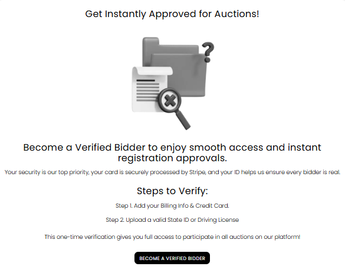
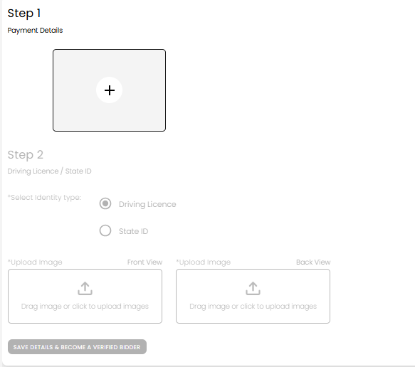
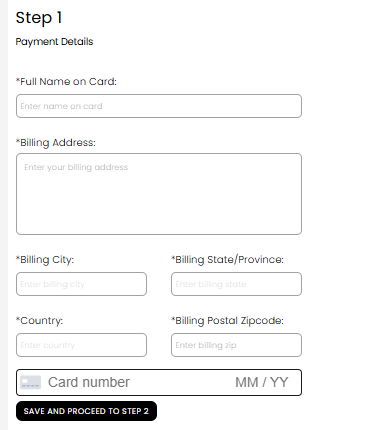
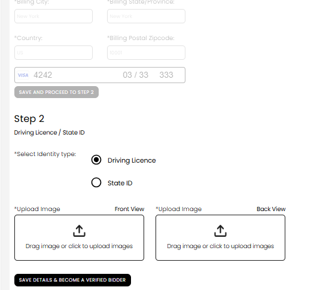
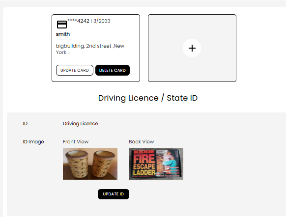

[Bidder](./index.md) · [Auction Journal](../../index.md)

# How to become a verified bidder?

After you **register** and sign in to the bidder dashboard, complete **Verified Bidder** verification once. You will add a **credit card** (processed securely by **Stripe**) and upload a **Driving Licence** or **State ID** (front and back). When both are accepted, you become a **verified bidder** and can get smoother access to auctions—including faster registration approvals on many listings.

---

## Before you start

- Finish **[bidder registration](registration.md)** and sign in.
- Have a valid **credit or debit card** and your **billing address**.
- Have clear photos or scans of your **Driving Licence** or **State ID** (**front** and **back**).

---

## Open the verification page

1. Sign in to your **bidder dashboard**.
2. In the menu, select **Verified Bidder**.
3. You will see an overview screen: **Get Instantly Approved for Auctions!**

*Overview: headline, Step 1 / Step 2 summary, and **BECOME A VERIFIED BIDDER**.*

4. Read the two steps:
   - **Step 1.** Add your billing info and credit card.
   - **Step 2.** Upload a valid State ID or Driving Licence.
5. Select **BECOME A VERIFIED BIDDER** to start.

Your card is processed by **Stripe**. Your ID helps Auction Journal confirm bidders are real. This is a **one-time** setup for full participation on the platform.

---

## Step 1 — Payment details

After you start, you see **Step 1 — Payment Details**. If you have no card saved yet, tap the **+** box to open the payment form.

*Step 1: **+** to add a card. Step 2 (ID upload) appears below but stays inactive until Step 1 is complete.*

### Payment form (required fields)

Fill every field marked with **\***:

| Field on screen | What to enter |
|-----------------|---------------|
| **Full Name on Card** | Name exactly as on the card |
| **Billing Address** | Street address (multiline box) |
| **Billing City** / **Billing State/Province** | Often filled when you enter ZIP |
| **Country** | Usually **US** |
| **Billing Postal Zipcode** | Your billing ZIP |
| **Card number** (Stripe field) | Card number, expiry (**MM / YY**), and security code |

*Payment form: billing address block, ZIP row, Stripe card line, and **SAVE AND PROCEED TO STEP 2**.*

3. Select **SAVE AND PROCEED TO STEP 2**.
4. Wait for confirmation that your payment method was saved.

**If you already have a card on file**, you may see your saved card instead of the form. Continue to Step 2 when Step 1 is complete.

**If your ID is already on file** but you are not verified yet, the page may ask only for your card. After saving the card, use **BECOME VERIFIED BIDDER** (wording may vary) to finish.

---

## Step 2 — Driving Licence / State ID

Step 2 stays **greyed out** until Step 1 is done. Then complete the ID form.

*After Step 1: saved card at top; Step 2 — choose **Driving Licence** or **State ID**, upload **Front View** and **Back View**, then **SAVE DETAILS & BECOME A VERIFIED BIDDER**.*

1. Under **Step 2 — Driving Licence / State ID**, select **Driving Licence** or **State ID**.
2. For **Front View** and **Back View**, drag an image into each box or click to upload.
3. Select **SAVE DETAILS & BECOME A VERIFIED BIDDER**.
4. When verification succeeds, you will see a success message. You are now a **verified bidder**.

---

## After you are verified

On the same **Verified Bidder** page you can manage what you submitted:

- **Saved card** — **UPDATE CARD**, **DELETE CARD**, or **+** to add another card.
- **ID on file** — view front/back thumbnails; **UPDATE ID** to replace them.

*After verification: card summary (masked number, expiry, billing snippet) and ID section with **UPDATE ID**.*

You may also receive a **confirmation email** that your verified bidder status is active.

---

## If something goes wrong

- **Step 2 is greyed out** — Complete Step 1 and save your card first.
- **Card will not save** — Check billing fields and card details; try another card if your bank declines the setup.
- **ID upload fails** — Use both front and back images, readable and uncropped, for the type you selected.
- **Still not verified after saving** — Ensure both card and ID steps completed; refresh the page or sign out and back in. Contact **[Help and Support](../help-and-support/index.md)** if it persists.
- **Bad ID image on file** — If the site asks you to **reupload** your ID, follow **UPDATE ID** and submit new front and back photos.

---

## Related questions

- [Is verification mandatory? What are the benefits?](verification-required.md)
- [What does it cost to become a bidder?](cost.md)
- [How do I register as a bidder?](registration.md)
- [How do I update my profile?](profile.md)
