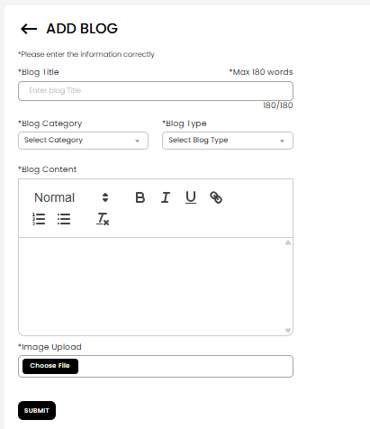

[Auction Journal](../index.md) · [Blog](./index.md)

# How can an auctioneer add blog content in Auction Journal?

Use the **Contents** area in the **Auctioneer Dashboard** to submit a blog post. After **Auction Journal** reviews and approves it, the post can appear on the public site [auctionjournal.com](https://auctionjournal.com) under **BLOGS** (for example [News and Events](https://auctionjournal.com/blogs/news)). Bidders and visitors read these articles there—see [How do I find helpful blogs?](../blog/find-blogs.md).

---

## Before you start

- Sign in to the **Auctioneer Dashboard**.  
- Have ready: **title**, **category**, **type**, **article text**, and a **featured image** (uploaded from your computer).  
- New posts are **not** public immediately. They are submitted for review first.

---

## Step 1 — Open Add Content

1. In the left menu, open **Contents**.  
2. Select **ADD Content** (page title **ADD CONTENT**).

---

## Step 2 — Choose Add Blog

Under **CONTENT TYPE**, select **Add Blog** (document icon).

---

## Step 3 — Fill in the blog form

The **ADD BLOG** form opens. Fields marked with **\*** are required.

| Field | What to enter |
|-------|----------------|
| **Blog Title** | Headline for your post (keep within the title length shown, e.g. max 180 words). |
| **Blog Category** | Choose from the dropdown (categories Auction Journal provides). |
| **Blog Type** | Choose from the dropdown (for example Article, News—options from Auction Journal). |
| **Blog Content** | Write the article in the editor (bold, italic, lists, links). |
| **Image Upload** | **Choose File** and select a featured image for the listing card on the public site. |

Select **Submit** when everything is complete.

---

## Step 4 — After you submit

- You should see a **success** message.  
- You are taken to **View Content**, where your blog appears with status **Unpublished** until Auction Journal publishes it.  
- When status is **Published**, you can use **View** to open the live post on [auctionjournal.com](https://auctionjournal.com) (blog URL includes your post id).

The system message on submit is along the lines of: your content was submitted and you will be notified once it is **reviewed and published**.

---

## Tips

- Match **category** and **type** to how readers filter blogs on the public site ([find blogs](../blog/find-blogs.md)).  
- Use a clear **featured image**—it appears on blog cards.  
- Proofread in the editor before **Submit**; major edits after approval may require resubmission depending on support policy.

---

## Related

- [How do I find helpful blogs? (public)](../blog/find-blogs.md)  
- [How can I add video content?](../video/add-content.md)  
- [Does a blog post appear immediately? What should I avoid?](approval-and-rejection.md)
