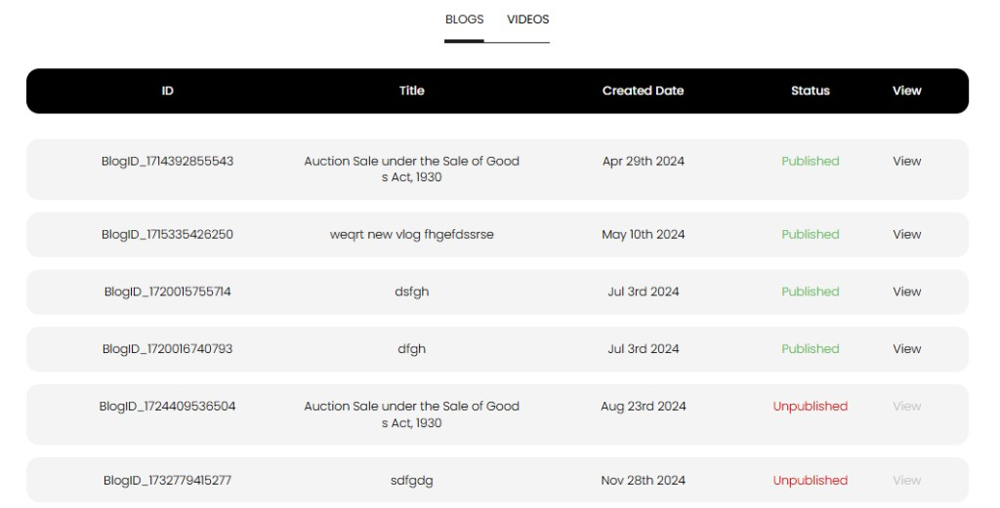

[Auction Journal](../index.md) · [Blog](./index.md)

# Does a blog post appear in Auction Journal immediately? What should I avoid in blog posts to prevent rejection?

**No.** A blog you submit does **not** go live on [auctionjournal.com](https://auctionjournal.com) right away. The **Auction Journal** team reviews your post first. After it is **approved**, it is marked **Published** and visitors can read it on the public **BLOGS** pages.

---

## When does my blog appear publicly?

| Step | What happens |
|------|----------------|
| 1. You submit | **Contents** → **ADD Content** → **Add Blog** → **Submit** ([how to add a blog](add-content.md)) |
| 2. Review | Your post stays **Unpublished** while our team assesses it |
| 3. Approved | Status changes to **Published** on **View Content** |
| 4. Live on the web | Readers see it on [auctionjournal.com](https://auctionjournal.com) (for example under **BLOGS** / News and Events) |

After submit, the dashboard message explains that your content was received and will be **reviewed and published** when approved.

---

## How to check status

1. Sign in to the **Auctioneer Dashboard**.  
2. Open **Contents** → **View Content** (`/dashboard/view-content`).  
3. Select the **BLOGS** tab.

| Status | Meaning |
|--------|---------|
| **Unpublished** (red) | Still in review, or not approved yet—not on the public site |
| **Published** (green) | Approved—live on the public website |

- **View** is active when **Published**—it opens your live blog on [auctionjournal.com](https://auctionjournal.com).  
- **View** is greyed out while **Unpublished**.

---

## If it is not approved within about 5 days

Review usually completes within a few business days. If your post is still **Unpublished** after **about 5 days**, contact **Help and Support** from the dashboard (**GET HELP** / user support) and include your **Blog ID** from the table.

---

## What to avoid so your blog is more likely to be approved

Our team checks quality, accuracy, and fit for a public auction audience. The form also blocks incomplete submissions.

### Required fields (form will not submit without these)

- **Blog Title**  
- **Blog Category** and **Blog Type**  
- **Blog Content** (body text in the editor)  
- **Image Upload** (featured image for the listing)

### Common reasons posts are delayed or not approved

| Avoid | Why |
|-------|-----|
| Empty or placeholder text (“test”, “lorem ipsum”, single sentence) | Not useful for readers |
| Missing or broken **featured image** | Image is required and shown on blog cards |
| Wrong **category** or **type** | Misleading filters on the public site |
| Off-topic, offensive, or misleading content | Must be appropriate for Auction Journal’s public audience |
| Copyright issues (text or images you do not have rights to use) | Legal and quality standards |
| Broken links in the article body | Hurts reader experience |
| Duplicate or near-duplicate posts submitted many times | Clutters review queue |

### Before you submit

- Proofread title and body.  
- Pick category/type that match the topic.  
- Use a clear, relevant featured image.  
- Write for bidders and sellers visiting your auction brand—not internal notes only.

---

## Related

- [How can I add blog content?](add-content.md)  
- [How do readers find blogs?](../blog/find-blogs.md)  
- [Questions — Blog](../sample_questions.md#blog)
