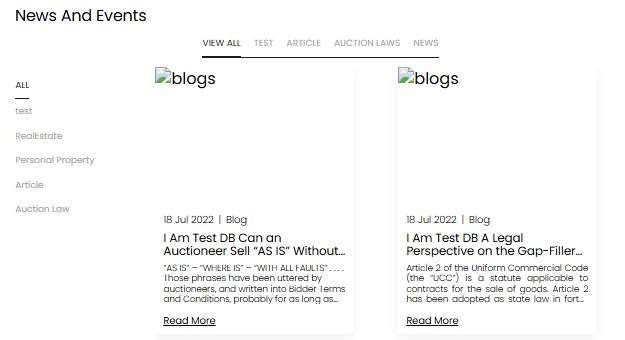

[Auction Journal](../index.md) · [Blog](./index.md)

# How do I find helpful blogs in Auction Journal?

Anyone can read blogs on the **public website** [auctionjournal.com](https://auctionjournal.com)—you do not need to sign in. Posts are written by **auctioneers** on Auction Journal and by **Auction Journal** itself. They are useful if you **bid**, follow auctions, or want tips on auction law, industry news, and buying at sales.

---

## Open the blog section

1. Go to [auctionjournal.com](https://auctionjournal.com).  
2. In the main menu, select **BLOGS**.

You land on the main **blogs** page, which shows **featured** articles and a **Latest News** section.

3. To browse the full library with filters, open **News and Events**:
   - From the blogs page, use **View all** (or the control that takes you to the latest news list), **or**  
   - Go directly to: [auctionjournal.com/blogs/news](https://auctionjournal.com/blogs/news)

For highlighted picks only, you can also visit [auctionjournal.com/blogs/featured](https://auctionjournal.com/blogs/featured).

---

## News and Events — filter by type and category

On **News and Events**, use the filters to narrow what you see:

| Filter | Where | What it does |
|--------|--------|----------------|
| **Type** (top row) | Horizontal tabs such as **VIEW ALL**, **ARTICLE**, **NEWS**, **AUCTION LAWS**, etc. | Shows posts of that **type** |
| **Category** (left side on desktop) | Vertical list starting with **ALL** | Shows posts in that **category** (for example Real Estate, Personal Property) |

On smaller screens, the same choices may appear as **dropdowns** (**Select Category**, **Select Types**).

*Example: **VIEW ALL** and **ALL** show every post; choose a type or category to focus on one topic.*

When you change a filter, the list updates. If nothing matches, you may see **No Blogs Found**—try **VIEW ALL** and **ALL** again.

---

## Open and read a post

Each card shows:

- Date and label **Blog**  
- **Title** and a short excerpt  
- **Read More**

Select **Read More** to open the full article. The address will look like `/blogs/` followed by the post id.

---

## Who writes these blogs?

| Source | What you get |
|--------|----------------|
| **Auctioneers** on Auction Journal | Company news, sale tips, local auction topics |
| **Auction Journal** | Platform updates, guides, and general auction content |

You are reading the same public content whether or not you have a bidder account. To **bid** in a sale, you still register for that auction separately; blogs are for learning and news only.

---

## Quick tips for bidders

- Start with **VIEW ALL** / **ALL**, then filter by **NEWS** or a category that matches what you collect or buy.  
- Check **featured** blogs on the main `/blogs` page for editor picks.  
- Use **Read More** only when a title interests you—the listing is the best way to scan many posts.

---

## Related

- [How do I find helpful videos in Auction Journal?](../video/find-videos.md)  
- [Questions — Blog (public)](../sample_questions.md#blog)  
- Auctioneer guides for *creating* blogs are listed separately under **Blog → For Auctioneer** in [sample questions](../sample_questions.md).
