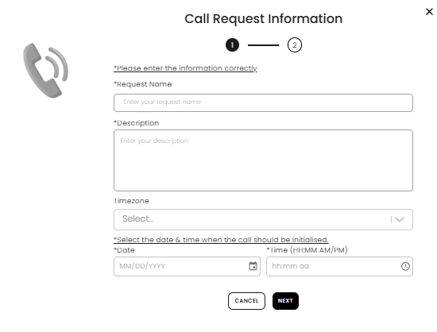

[Help and Support](./index.md) · [Auction Journal](../index.md)

# How do I start a “Request a Callback” support request? How helpful is it?

**Request a Callback** is for asking Auction Journal support to **phone you** at a **date and time you choose**. It works well when you prefer talking through an issue on a call and want a **recorded ticket** (ID like **RAC_123456**) in **Ticket History**.

It is **not** the same as live chat and is **not** instant—you submit a request and the team follows up by phone around your chosen time.

---

## Before you start

- Be signed in as an **auctioneer** or **bidder**.
- Open **GET HELP** (auctioneer) or **Bid Support** (bidder), then select **Request a Callback!**

---

## Step 1 — Call request information

A window titled **Call Request Information** opens with a **2-step** progress indicator (step **1** active).

1. Read *Please enter the information correctly*.
2. Enter **Request Name** (short title for the call).
3. Enter **Description** (what you need help with).
4. **Timezone** may appear but is not editable on the auctioneer form.
5. Choose **Date** (today or later) and **Time** (for example 02:30 PM).
6. Select **NEXT**.

---

## Step 2 — Your contact details

1. Confirm or edit **first name**, **last name**, **email**, and **phone** (auctioneer accounts often use **+1** and ten digits).
2. Select **SUBMIT** (or the final submit control on your screen).
3. You should see a success message; the window closes.

You receive a **confirmation email** at the address on the request.

---

## What happens next

- Your request appears under **Ticket History** → **CALLBACK REQUESTS** with status **Raised** (or **Open** / **Closed** after support updates it).
- Support may add **notes** you can read when you open the ticket; you **cannot reply** in the app on callback tickets—use **Write to Us** or **Request a Callback** again if you need more help.

---

## How helpful is it?

| Works well when… | Less suitable when… |
|------------------|---------------------|
| You want a **scheduled phone call** | You need an **instant** text answer (use **chat**) |
| You want a **ticket number** for reference | You need to **attach files** and thread replies (use **Write to Us**) |
| You can wait for support to call at your chosen time | The issue is urgent and complex (use **Write to Us** with **High** priority) |

---

## Related

- [Ticket history](./ticket-history.md)
- [Getting help](./getting-help.md)
