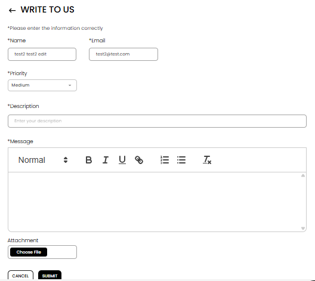

[Help and Support](./index.md) · [Auction Journal](../index.md)

# How do I start email support? How convenient is it?

**Write to Us** is Auction Journal’s **email-style support**: you send a message with **priority**, optional **attachments**, and get a **ticket ID** (**WTUS_…**) you can track and **reply** to from **Ticket History**.

---

## Open Write to Us

| Role | Steps |
|------|--------|
| **Auctioneer** | **Support** → **GET HELP** → **Write to Us** |
| **Bidder** | **Bid Support** → **Write to Us** |

The page title is **WRITE TO US**.

---

## Fill in the form

1. Read *Please enter the information correctly*.
2. **Name** and **Email** are usually filled from your account (you may not be able to change them).
3. Select **Priority**: **Low**, **Medium**, or **High** — use **High** only when the issue is urgent.
4. Enter **Description** — a short summary of the issue (like a subject line).
5. In **Message**, type your full explanation. You can use bold, lists, and links if the editor offers them.
6. Under **Attachment**, choose a file if screenshots or documents help (optional).
7. Select **SUBMIT**.

After submit, you return to the previous screen and should see a success message. Check your email for confirmation.

---

## Follow up on the same ticket

1. Open **Ticket History** → **E-MAIL REQUESTS**.
2. Open your ticket.
3. Select **REPLY TO ADMIN**.
4. The form title becomes **WRITE TO ADMIN** — add your message and submit again.

Each reply keeps the conversation on the **same ticket ID**.

---

## How convenient is it?

| Advantage | What to expect |
|-----------|----------------|
| **Full detail** in one message | Support responds on their schedule—not live chat speed |
| **Attachments** for screenshots or PDFs | Upload only what is needed; avoid sensitive data you do not need to share |
| **Priority** sets urgency | **High** does not mean instant; it helps support triage |
| **Thread history** in one place | Status may show **Raised**, then **Open** after you reply, **Closed** when resolved |
| **Ticket ID** for reference | Quote **WTUS_…** if you contact support again |

For a **quick** question while browsing, the **chat** icon may be faster; for anything you need to **track** or **attach files** to, **Write to Us** is the better fit.

---

## Related

- [Ticket history](./ticket-history.md)
- [Getting help](./getting-help.md)
