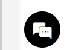

[Help and Support](./index.md) · [Auction Journal](../index.md)

# Is the Auction Journal chatbot suitable for immediate support?

The **chat** button (floating icon with speech bubbles, usually at the bottom corner of the screen) opens a **live chat** window while you use Auction Journal.

---

## When chat is a good fit

Use chat when you:

- Have a **quick question** and want an answer **now** (during support hours).
- Are already on a page and do not want to leave to fill a form.
- Need a **short clarification** (for example how to find a menu).

Chat is meant for **immediate, conversational** help.

---

## When to use something else instead

| Situation | Better option |
|-----------|----------------|
| You need a **ticket number** or paper trail | **Write to Us** (**WTUS_…**) |
| You want to **attach files** or write a long explanation | **Write to Us** |
| You want a **phone call** at a set time | **Request a Callback!** (**RAC_…**) |
| You want to see **past requests** | **Ticket History** |
| General how-to already documented | **FAQ** (and **Listing Policy** for auctioneers) |

Chat conversations **do not appear** in **Ticket History**. If support asks you to open a ticket, use **Write to Us**.

---

## Availability

Whether someone is online depends on **support staffing and hours** configured for chat. Outside those hours you may see a message to leave contact details or use **Write to Us**.

---

## Not the same as auction bidding chat

During a **live auction**, there may be a separate chat for that event. That chat is for the auction, not for Auction Journal account or billing support.

---

## Related

- [Getting help](./getting-help.md)
- [Email support](./email-support.md)
