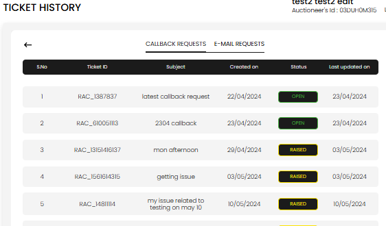
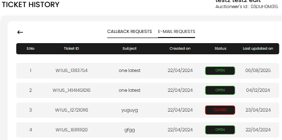

[Help and Support](./index.md) · [Auction Journal](../index.md)

# How do I view my ongoing and past support requests, and how do I continue a conversation?

Use **Ticket History** from the **GET IN TOUCH** / **Bid Support** page to see **callback** and **email** requests you have submitted.

---

## Open Ticket History

| Role | Steps |
|------|--------|
| **Auctioneer** | **Support** → **GET HELP** → **Ticket History** |
| **Bidder** | **Bid Support** → **Ticket History** |

The page title is **TICKET HISTORY**. Use the **back** arrow to return to GET IN TOUCH.

---

## Two tabs

### CALLBACK REQUESTS

Lists phone callback tickets (**RAC_…**).

| Column | Meaning |
|--------|---------|
| **Ticket ID** | Your reference (for example RAC_1387837) |
| **Subject** | Request name you entered |
| **Created on** | Date you submitted |
| **Status** | **Raised**, **Open**, or **Closed** |
| **Last updated on** | Last change date |

Select a row to open details: your request text, requested call date/time, and any **admin notes**. You **cannot reply** on callback tickets in the app.

### E-MAIL REQUESTS

Lists **Write to Us** tickets (**WTUS_…**).

Same columns; **Subject** is your **Description** from the form. Status **Open** often means there has been activity or a reply on the thread.

---

## Continue a conversation (email only)

1. Open the **E-MAIL REQUESTS** tab.
2. Select the ticket you want.
3. Read the message thread (your messages and **Admin** replies).
4. Select **REPLY TO ADMIN**.
5. Add your message (and attachment if needed) and submit.

Your reply stays on the **same WTUS_ ticket**. If the ticket is **Closed**, support has marked it resolved—start **Write to Us** for a new issue instead of expecting more replies on a closed ticket.

**Callback tickets:** view only; to ask more, submit a new **Request a Callback!** or use **Write to Us**.

---

## Status colors (typical)

| Status | Meaning |
|--------|---------|
| **Raised** | Submitted; support may not have finished handling yet |
| **Open** | Active, often after a reply on email tickets |
| **Closed** | Resolved from support’s side |

---

## Related

- [Email support](./email-support.md)
- [Callback support](./callback-support.md)
- [Getting help](./getting-help.md)
