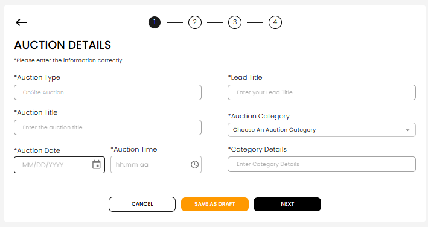
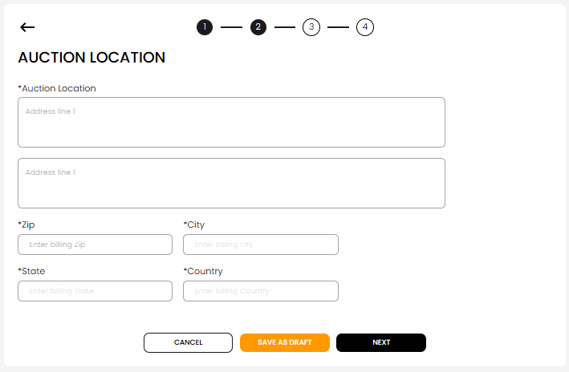
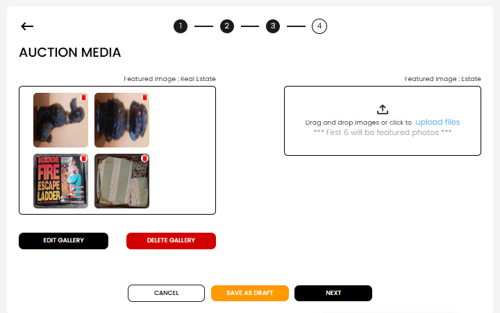
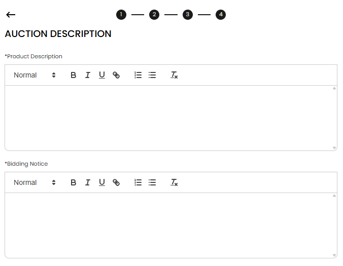
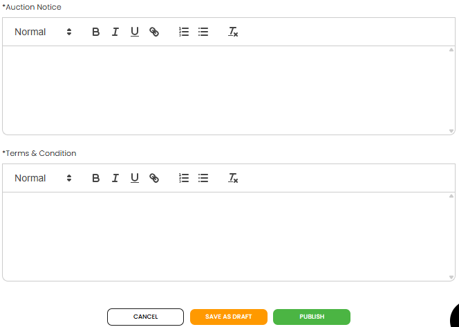

[Listing](./index.md) · [Auction Journal](../index.md)

# What is a listing? How do I create a new listing?

---

## What is a listing?

A **listing** is how you **promote an upcoming auction** on Auction Journal’s public website. It is separate from building a full **Auction** inside your CRM.

A listing tells bidders:

- **What** kind of auction it is (on-site, live webcast, timed online, and so on)
- **When** and **where** it happens
- **Photos** and **written notices** (description, bidding rules, terms)

| State | What it means for you |
|-------|------------------------|
| **Draft** | Only you see it under **Manage Listings** — not on the public site yet |
| **Published** | Bidders can find it on Auction Journal |
| **Live** | Published and the auction date has not passed |
| **Past** | Auction date has passed |

After publish, bidders can request a **callback** or generate a **bid pass** (for on-site auctions), depending on listing type.

---

## Before you start

- Sign in to the **Auctioneer Dashboard**.
- In the sidebar, open **Listings** → **Create** (or go to **Manage** and start a new listing from there if your screen offers it).
- Have auction details, address, photos, and notice text ready. You can **save as draft** and finish later.

---

## Step 0 — Select type of listing

Choose the format that matches your event. You cannot change the type later in the same flow without starting over. For a full comparison of all five types and which to pick, see **[What listing types exist? Which type should I choose?](listing-types.md)**.

Select the row for your type (the **+** icon) to open the build wizard.

---

## Step 1 — Auction Details

The screen title is **AUCTION DETAILS**. Step **1** of **4** is highlighted at the top.

1. Read *Please enter the information correctly*.
2. **Auction Type** is filled from your earlier choice (you usually cannot edit it here).
3. Enter **Lead Title** and **Auction Title**.
4. Choose **Auction Category** and enter **Category Details**.
5. Pick **Auction Date** (must be at least two days from today) and **Auction Time**.
6. Choose one:
   - **SAVE AS DRAFT** (orange) — save and go to **Manage Listings**
   - **NEXT** — continue to location
   - **CANCEL** — leave without saving (confirm if prompted)

---

## Step 2 — Auction Location

The screen title is **AUCTION LOCATION**.

1. Enter **Auction Location** (address lines).
2. Enter **ZIP**; **City**, **State**, and **Country** may fill in automatically — check them.
3. **SAVE AS DRAFT**, **NEXT**, or **CANCEL** as in step 1.

---

## Step 3 — Auction Media

The screen title is **AUCTION MEDIA**.

1. Upload images (drag and drop or choose files). At least one image is required to continue.
2. If your category is **Estate With Real Estate**, you upload separate galleries for **Real Estate** and **Estate** (complete Real Estate first).
3. The first several images may be used as featured photos (see on-screen note).
4. **SAVE AS DRAFT**, **NEXT**, or **CANCEL**.

---

## Step 4 — Auction Description

The screen title is **AUCTION DESCRIPTION** on the first part of this step.

1. Fill in **Product Description** and **Bidding Notice** (required rich-text fields).

Scroll down on the same step for:

2. Fill in **Auction Notice** and **Terms & Condition**.
3. Choose one:
   - **SAVE AS DRAFT** — keep working later from **Manage Listings**
   - **PUBLISH** (green) — make the listing live (see below)
   - **CANCEL**

If the listing is **already published**, the green button may say **Save Changes** instead of **Publish**.

---

## What happens when you select Publish

### If you qualify for free listings

If your account already has **free listing** access (you verified the Auction Journal link on your website), **Publish** puts the listing live immediately. You may see a success screen, then you can open **Manage Listings**.

Setup for free listings: [Can I publish my listing for free?](free-listing.md).

### If you do not qualify yet — payment options

A window titled **PLEASE SELECT AN OPTION** appears:

| Option | What to do |
|--------|------------|
| **CREATE A FREE LISTING** | Add Auction Journal’s link on **your website**, then complete verification under **Listings** → **Free Listing**. After you qualify, publish again. |
| **PAY $…** | Pay the one-time listing fee at checkout. When payment succeeds, the listing is published. |

You can **Close** the window and finish later; your work is saved as a **draft** in **Manage Listings**.

For pricing details, see [What is the cost of publishing a listing?](listing-cost.md).

---

## After you publish or save a draft

- **Manage Listings** — view drafts, publish drafts, or edit live listings (limited fields when published).
- **Free Listing** — earn free publish for future listings by hosting the Auction Journal badge on your site.

---

## Related

- [Can I publish my listing for free?](free-listing.md)
- [Listing module home](./index.md)
- [Help and Support](../help-and-support/index.md) if you are stuck
