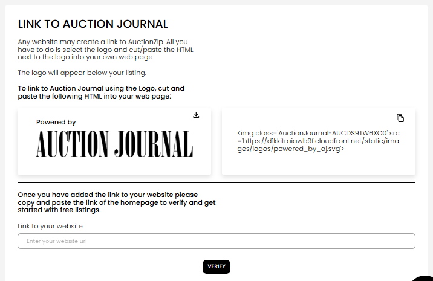
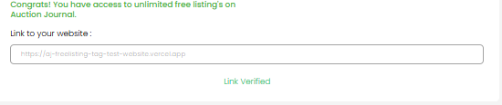

[Listing](./index.md) · [Auction Journal](../../index.md)

# Can I publish my listing for free? If yes, how?

**Yes—if your account qualifies for free listings.** Otherwise you pay the listing fee shown when you publish.

Free listing is **not automatic**. You add Auction Journal’s **“Powered by”** badge on **your own website**, then verify that link in the Auctioneer Dashboard. Auction Journal checks from time to time that the badge is still on your site. If a check fails, **free listing access can be removed**, but **listings you already published stay live**.

---

## Paid vs free (quick comparison)

| | **Free listing** | **Paid listing** |
|---|------------------|------------------|
| **Requirement** | Verified “Powered by” tag on your website | Pay the listing fee at checkout |
| **Where you set it up** | **Listings** → **Free Listing** | **Pay** when you publish (or from the payment prompt) |
| **After you lose free access** | Pay to publish **new** listings; old published listings unchanged | Same as today |

---

## Before you start

- Sign in to the **Auctioneer Dashboard** (not the bidder site).
- You need a **website you control** where you can paste HTML (homepage is typical).
- Have your site’s **full URL** ready (for example `https://www.yourauctioncompany.com`).

---

## Step 1 — Open Free Listing

1. In the dashboard, open **Listings** in the main menu.
2. Select **Free Listing**.

You land on **Free Listings** with the heading **LINK TO AUCTION JOURNAL**.

---

## Step 2 — Add the Auction Journal link on your website

1. On the Free Listing page, find the **Powered by** logo preview and the **HTML** in the box beside it.
2. Select the **copy** control on the HTML box and paste that code into your website’s HTML (often the homepage footer or a visible area bidders see).
3. Optional: use the **download** control on the logo box if you need the image file separately.

The pasted tag is tied to **your auctioneer account**. Do not reuse another auctioneer’s snippet.

The HTML includes an image with a class name that contains your account id and a link to Auction Journal’s logo file. Your site must serve that page at the URL you will verify.

---

## Step 3 — Verify your website

1. After the tag is live on your site, return to **Free Listing** in the dashboard.
2. Under **Link to your website :**, enter the **homepage URL** where you added the tag (the same address visitors use to open your site).
3. Select **Verify** and wait until the check finishes.

**If verification fails**, confirm the HTML is on the page at that exact URL, the page is publicly reachable, and you did not change the snippet. Fix the site and try **Verify** again.

**If verification succeeds**, you will see:

- A green message: **Congrats! You have access to unlimited free listing's on Auction Journal.**
- Your URL in the field (often read-only afterward).
- **Link Verified** instead of the Verify button.

You may also see a short thank-you screen; use **Go back to Free Listing** to return to this page.

---

## Step 4 — Publish listings without paying

1. Create or open a listing draft as you normally would (**Listings** → **Create** or **Manage**).
2. When you **publish**, if your account still has free listing access, you should **not** be asked to pay the listing fee.
3. If you are not eligible, the dashboard offers **Create a free listing** (back to this page) or **Pay** the listed amount.

---

## Keeping free listing access

- Leave the **Powered by** HTML on the website URL you verified.
- Auction Journal **re-checks your site on a schedule**. You do not need to click Verify again for those checks.
- If a re-check fails (tag removed, wrong page, or site unreachable), **free listing eligibility can be turned off**. You can publish new listings only after you pay or restore the tag and pass verification again.
- **Listings already published are not taken down** when eligibility ends.

---

## Related topics

- [Auctioneer Dashboard](../auctioneeer/dashboard.md) — **Listings** menu
- [Who is an auctioneer?](../auctioneeer/role.md)
- More listing guides: [Listing home](./index.md)
