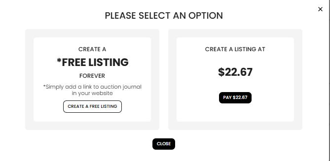

[Listing](./index.md) · [Auction Journal](../index.md)

# What is the cost of publishing a listing in Auction Journal? Is it a one-time payment, and are there any hidden charges?

---

## What does it cost?

When you **publish** a listing and your account is **not** on free listing, you pay a **single listing fee** shown in the dashboard at checkout time.

You see that amount when you select **Publish** on a new listing and the window **PLEASE SELECT AN OPTION** appears. The paid option is labeled **CREATE A LISTING AT $…** with a **Pay $…** button—for example **Pay $22.67** if that is the current fee on your account.

**The exact dollar amount is set by Auction Journal** (platform listing price). It can change over time; always use the **price shown on your screen** when you publish—that is what you are charged for that listing.

You do **not** pay this fee to save a **draft**. Drafts are free to create and edit until you publish.

---

## Is it a one-time payment?

**Yes—for each listing you publish on the paid path.**

| What you pay for | How billing works |
|------------------|-------------------|
| **Publishing one listing** | **One charge** when you complete checkout for that listing |
| **Keeping the listing live** | **No extra recurring listing fee** in the dashboard for leaving a published listing on the public site until its auction date passes |
| **Another listing** | **Another one-time fee** each time you publish a **new** listing (unless you use free listing for that publish) |

Payment runs through **Billings** checkout (card on file or card you enter). After success, you are sent to **Manage Listings** and the listing is published.

To review charges later, open **Billings** → **Payment History** in the Auctioneer Dashboard.

---

## Can I publish without paying?

**Yes, if you qualify for free listings.**

If your account has **free listing** access, **Publish** can make the listing live **without** that listing fee. You must complete the **Free Listing** setup (Auction Journal link on your website) first. See [Can I publish my listing for free?](free-listing.md).

If you are **not** eligible, the only way to publish from the payment window is **Pay $…** (or set up free listing and publish again later).

---

## Are there any hidden charges?

**For publishing the listing itself—no.** The amount on the **Pay $…** button is the listing publish charge for that listing. Checkout does not add a separate “surprise” listing publish fee beyond what you confirm at payment.

Be aware of **separate, optional** costs that are **not** part of the basic publish fee:

| Item | Is it included in the listing publish fee? |
|------|------------------------------------------|
| **Saving or editing a draft** | No charge for publish (draft only) |
| **Publishing the listing** (paid path) | **Yes** — this is the one-time fee above |
| **Free listing** (qualified accounts) | **$0** to publish that listing |
| **Highlighting / ads** for more bidder reach | **No** — paid **Advertisement** products are separate (see sample question on highlighting listings) |
| **Stripe Connect** for receiving bidder money | **No** — different setup; not the listing publish fee |
| **CRM Auction** module | **No** — separate from a public **Listing** |

**Card processing:** You pay with a card saved under **Billings** → **Payment Method** (handled securely via Stripe). See [Why should I add card details?](auctioneeer/payment-method.md).

**Taxes:** If your checkout or invoice shows tax, it will appear on the payment or invoice screen—not as an undisclosed extra after the fact.

---

## Typical paid publish flow (summary)

1. Finish the listing wizard and select **Publish**.
2. If you are not on free listing, the system saves your listing as a draft and shows **PLEASE SELECT AN OPTION**.
3. Select **Pay $…** (not **Create a free listing** unless you intend to set up free listing).
4. Complete **Billings** checkout for that listing.
5. Listing goes live on the public site; fee is charged **once** for that publish.

---

## Related

- [Can I publish my listing for free?](free-listing.md)
- [Create a new listing](create-listing.md)
- [Listing types](listing-types.md)
- [Add a payment card](../auctioneeer/payment-method.md)
