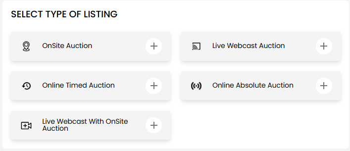

[Listing](./index.md) · [Auction Journal](../index.md)

# What listing types exist? Which type should I choose for my listing?

When you create a listing, the first step is **SELECT TYPE OF LISTING**. You pick **one** type before you enter auction details. That choice stays on the listing and affects how bidders interact with you on the public site.

To walk through the full create flow after you choose a type, see [How do I create a new listing?](create-listing.md).

---

## What listing types exist?

Auction Journal offers **five** listing types in the Auctioneer Dashboard:

| Listing type | In short |
|--------------|----------|
| **OnSite Auction** | Bidders attend the sale **in person** at your address. |
| **Live Webcast Auction** | The sale is run as a **live online** event (stream / webcast). |
| **Online Timed Auction** | Bidding happens **online** over a defined time period. |
| **Online Absolute Auction** | An **online** sale sold to the highest bidder with **no reserve** (absolute). |
| **Live Webcast with OnSite Auction** | **Both** an on-site sale and a **live webcast** for remote bidders. |

These names appear exactly as shown when you select a type under **Listings** → **Create**.

---

## How bidders respond (why type matters)

On the public Auction Journal site, signed-in bidders see one main action on a **live** listing (before the auction date passes):

| Your listing type | Button bidders see |
|-------------------|-------------------|
| **OnSite Auction** | **GENERATE BID PASS** |
| **Live Webcast Auction** | **REQUEST A CALLBACK** |
| **Online Timed Auction** | **REQUEST A CALLBACK** |
| **Online Absolute Auction** | **REQUEST A CALLBACK** |
| **Live Webcast with OnSite Auction** | **REQUEST A CALLBACK** |

- **Bid pass** — Used for **OnSite Auction** only. Bidders request a pass for your in-person sale; you can view and export those requests from your dashboard.
- **Request a callback** — Used for **all other** types. Bidders ask you to contact them about the event; you receive callback requests to follow up.

Choose the type that matches how you actually run the sale so bidders use the right action.

---

## Which type should I choose?

Use this guide when you are on **SELECT TYPE OF LISTING**:

### Choose **OnSite Auction** when

- The sale is **primarily in person** at a physical location.
- You want bidders to **generate a bid pass** for entry or participation at the site.
- You are **not** offering a live webcast as the main way to bid.

### Choose **Live Webcast Auction** when

- Bidders participate **online** through a **live** stream or webcast.
- There is **no** separate in-person floor sale you need to promote on the same listing.
- You expect **callback** requests from bidders who want you to reach out.

### Choose **Online Timed Auction** when

- The sale is **online** and bidding runs for a **set time window** (timed auction).
- Bidders will **request a callback** rather than a bid pass.

### Choose **Online Absolute Auction** when

- The sale is **online** and items sell **absolute** (to the high bidder, no reserve).
- Same bidder action as other online types: **request a callback**.

### Choose **Live Webcast with OnSite Auction** when

- You have **both**:
  - bidders at the **physical** location, and  
  - bidders joining through a **live webcast**.
- On the public site, bidders still use **REQUEST A CALLBACK** (not a bid pass), even though part of the event is on-site. Use **OnSite Auction** instead if you only need bid passes for a purely in-person sale.

---

## Quick decision table

| How you run the sale | Choose this type |
|----------------------|------------------|
| In-person only; bid passes | **OnSite Auction** |
| Live online only | **Live Webcast Auction** |
| Online, timed bidding period | **Online Timed Auction** |
| Online, absolute (no reserve) | **Online Absolute Auction** |
| In-person **and** live webcast together | **Live Webcast with OnSite Auction** |

---

## Important reminders

- **Pick carefully before you continue.** After you start the wizard, **Auction Type** is fixed for that listing. To use a different type, go back from step 1 or start a **new** listing from **Listings** → **Create**.
- **Listing type is not the same as an Auction** in your CRM. A listing promotes the event on Auction Journal; building and running the auction in the dashboard is a separate workflow.
- **Publishing** (draft, pay, or free listing) works the same for all types. See [Can I publish my listing for free?](free-listing.md).

---

## Related

- [Create a new listing](create-listing.md)
- [Listing home](./index.md)
