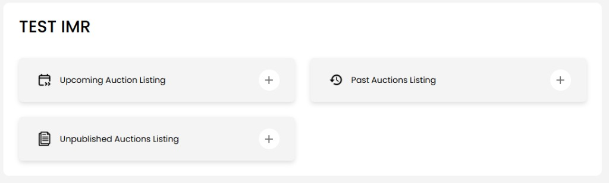
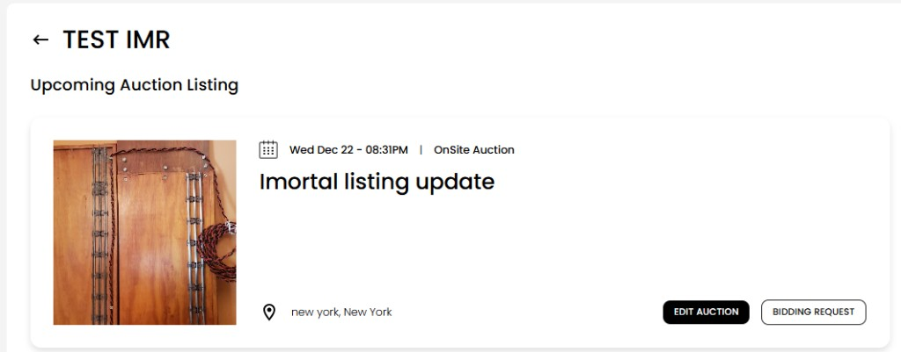
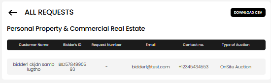

[Listing](./index.md) · [Auction Journal](../index.md)

# How do I view and manage my listings, and how do I see bidders interested in my listing?

Use **Manage Listings** in the Auctioneer Dashboard to see your listings by status, edit or publish them, and open **bidding requests** from interested bidders.

---

## Open Manage Listings

1. Sign in to the **Auctioneer Dashboard**.
2. In the sidebar under **Listings**, select **Manage**.

You land on a page headed with your **company name** and three categories:

| Category | What it shows |
|----------|----------------|
| **Upcoming Auction Listing** | Published listings whose **auction date is still in the future** |
| **Past Auctions Listing** | Published listings whose **auction date has passed** |
| **Unpublished Auctions Listing** | **Drafts** — created but not yet published to the public site |

Select a category (the **+** on the row) to see listing cards in that group.

Use the **back** arrow at the top to return to the three categories.

---

## Listing cards — what you can do

Each card shows a photo, **date and time**, **listing type**, **title**, and **location**.

### Published listings (Upcoming or Past)

| Button | When it appears | What it does |
|--------|-----------------|--------------|
| **EDIT AUCTION** | Auction date is **still in the future** (Upcoming) | Opens the listing wizard to change details (limited compared to a draft). |
| **VIEW AUCTION** | Auction date has **passed** (Past) | Opens the **public** listing page on Auction Journal in a new tab. |
| **BIDDING REQUEST** | Listing is **published** | Opens **All requests** for that listing (bid passes or callbacks — see below). |

### Unpublished (draft) listings

| Button | What it does |
|--------|----------------|
| **Publish Auction** | Publishes the listing (free listing if you qualify, otherwise payment — see [listing cost](listing-cost.md) and [free listing](free-listing.md)). |
| **Edit Auction** | Continues editing the draft in the build wizard. |

If a category is empty, you may see **OOPS!** with **Create a new listing** — see [Create a new listing](create-listing.md).

When there are many listings, use **pagination** at the bottom of the list.

---

## How bidders show interest

On the **public** Auction Journal site, signed-in bidders act on your **published** listing before the auction date passes:

| Listing type | Bidder action on public site |
|--------------|------------------------------|
| **OnSite Auction** | **Generate bid pass** |
| All other types | **Request a callback** |

Each bidder can only submit **one** request per listing. You do not approve or decline requests in the dashboard today — you **view** and **export** them, then follow up outside Auction Journal (phone, email, etc.).

Details by type: [Listing types](listing-types.md).

---

## View bidding requests for one listing

1. From **Manage** → **Upcoming** or **Past**, find the published listing.
2. Select **BIDDING REQUEST**.

You open **ALL REQUESTS** for that listing.

The table includes:

| Column | Meaning |
|--------|---------|
| **Customer Name** | Bidder’s name |
| **Bidder's ID** | Bidder ID on Auction Journal |
| **Request Number** | Reference for the bid pass or callback request |
| **Email** | Bidder email |
| **Contact no.** | Bidder phone |
| **Type of Auction** | Listing type (for example OnSite Auction) |

- **OnSite Auction** listings show **bid pass** requests.
- Other listing types show **callback** requests.

If no one has responded yet, you may see **No Request Found**.

Use the **back** arrow to return to Manage Listings (same category you came from).

**Note:** Bidding requests are only available for **published** listings. Drafts must be published first.

---

## Download requests (CSV)

On **ALL REQUESTS**, select **DOWNLOAD CSV** (top right).

- A file downloads (for example `bidRequests-listing.csv`).
- Use it in Excel or your CRM to contact bidders or run your own mail merge.

The export includes bidder name, email, phone, request number, and auction type/category fields.

---

## Related tasks

| Task | Where |
|------|--------|
| Create a new listing | **Listings** → **Create** — [Create listing](create-listing.md) |
| Publish cost / free listing | [Listing cost](listing-cost.md), [Free listing](free-listing.md) |
| Choose listing type | [Listing types](listing-types.md) |

---

## Related

- [Listing home](./index.md)
