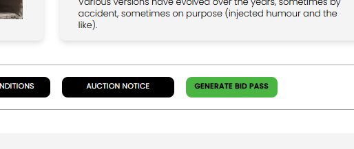

[Auction Journal](../index.md) · [Listing](./index.md)

# How do I register for a listing? Are there any charges?

To **register your interest** in a listing, open that listing’s public page on [auctionjournal.com](https://auctionjournal.com), sign in as a **bidder**, and use the green action button at the bottom. What the button says depends on the **listing type**.

Auction Journal does **not** charge you a fee to register on a listing. Any money you pay later comes from the **auctioneer’s sale** (for example if you win items), not from clicking **GENERATE BID PASS** or **REQUEST A CALLBACK**.

---

## Open a listing

1. [Search for listings](search-listings.md) or follow a link from a listing card.
2. Open the listing URL: `https://auctionjournal.com/listings/{listing-id}`  
   (the `{listing-id}` is the listing’s unique ID on Auction Journal).

You see the auction title, **listing type**, category, auctioneer company, address, date and time, photos, and **Product Description**.

You can also open **View Gallery**, **Bidding Notice**, **TERMS & CONDITIONS**, and **AUCTION NOTICE** before you register.

---

## Which button you see

Before the listing’s **auction date** has passed, one green button appears at the bottom:

| Listing type | Button | What you are doing |
|--------------|--------|---------------------|
| **OnSite Auction** | **GENERATE BID PASS** | Ask for a **bid pass** for the in-person sale |
| **Live Webcast Auction** | **REQUEST A CALLBACK** | Ask the auctioneer to **call you back** about the event |
| **Online Timed Auction** | **REQUEST A CALLBACK** | Same — callback request |
| **Online Absolute Auction** | **REQUEST A CALLBACK** | Same — callback request |
| **Live Webcast with OnSite Auction** | **REQUEST A CALLBACK** | Same — callback request (not a bid pass on the public page) |

*Example: an **OnSite Auction** listing shows **GENERATE BID PASS** next to notice buttons.*

For more on types, see [What listing types exist?](listing-types.md).

If the auction date has **already passed**, the button is disabled and labeled **Past Listing** — you cannot register on that listing anymore.

---

## Steps to register

1. On the listing page, select **GENERATE BID PASS** or **REQUEST A CALLBACK** (whichever is shown).
2. If you are **not signed in** as a bidder, a **login** window opens. Sign in with your bidder email and password (or [register as a bidder](../bidder/registration.md) first, then return to the listing).
3. After you are signed in, select the same button again if needed.
4. When registration succeeds, you see a confirmation such as **Successfully Joined**.

**One registration per listing:** You can only register **once** per listing with your bidder account. If you try again, Auction Journal shows an error message instead of creating a duplicate.

---

## Are there any charges?

| Action | Charge from Auction Journal |
|--------|----------------------------|
| **Bidder sign-up** | **$0** — see [What does it cost to become a bidder?](../bidder/cost.md) |
| **Generate bid pass** on a listing | **$0** |
| **Request a callback** on a listing | **$0** |

Registering on a listing only tells the **auctioneer** you are interested. It is **not** the same as registering for a full **auction** in the CRM, paying buyer’s premium, or winning lots.

- **Verified bidder** setup may ask you to save a card for **future auction rules** — that is still not a fee to register on a listing. See [verification](../bidder/verification.md) and [Is verification mandatory?](../bidder/verification-required.md).
- **Auctioneers** may pay to **publish** a listing on the public site; that cost is on the auctioneer side, not yours as a bidder browsing listings.

---

## What happens after you register

- The **auctioneer** can see your request in their dashboard (bid passes or callback requests for that listing) and may contact you or use the information for the sale.
- Auction Journal does **not** currently offer a bidder button to **cancel** a bid pass or callback after you submit it.

To see listings you have already registered for, open **My Passes** or **My Requests** in the Bidder Dashboard — see [How do I see my registered listings?](registered-listings.md).

---

## Related

- [How do I see my registered listings?](registered-listings.md)
- [How do I search for listings?](search-listings.md)
- [Listing types](listing-types.md)
- [Bidder registration](../bidder/registration.md)
