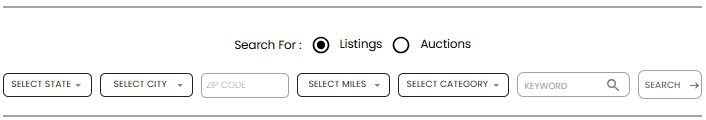

[Auction Journal](../index.md) · [Listing](./index.md)

# How do I search for listings in Auction Journal?

Anyone can search **listings** on the public website [auctionjournal.com](https://auctionjournal.com)—you do **not** need to sign in. A **listing** is an auctioneer’s published promotion for an upcoming sale (date, location, photos, and notices). Only **published** listings with a future auction date appear in the main search (unless you open an auctioneer’s **Past Listings** page).

You can start from the main menu, the home page, the **Find Listings** page, the full **listings** browse page, or an **auctioneer’s profile** in the directory.

---

## Quick paths

| Goal | Where to go |
|------|-------------|
| Calendar or US map by state | Menu **FIND LISTINGS** → [auctionjournal.com/listings/find](https://auctionjournal.com/listings/find) |
| Filters (state, city, ZIP, miles, category, keyword) | [auctionjournal.com/listings](https://auctionjournal.com/listings) or the same filter bar on the [home page](https://auctionjournal.com) |
| Featured picks | Home **Featured Listings**, or [auctionjournal.com/listings/featured](https://auctionjournal.com/listings/featured) |
| One auctioneer’s listings | [Auctioneer Directory](https://auctionjournal.com/auctioneer/search-by-map) → state → company → **CURRENT LISTINGS** / **View All** |

---

## 1. Find Listings — by date or by state

1. Open [auctionjournal.com](https://auctionjournal.com).
2. In the top menu, select **FIND LISTINGS**.

You land on [auctionjournal.com/listings/find](https://auctionjournal.com/listings/find).

### Search by date (calendar)

- Use the **calendar** on the left. Days with listings show a count on the tile.
- Select a day. The panel shows how many listings that day has by type (for example **ONSITE**, **LIVE WEBCAST**, **ONLINE ABSOLUTE**, **ONLINE TIMED**).
- Select **VIEW AUCTIONS ON (date)**.

You are taken to [auctionjournal.com/listings](https://auctionjournal.com/listings) with results for that **auction date** only.

### Search by state (US map)

- Below the calendar, optional listing-type buttons (**All**, **ONSITE**, **LIVE WEBCAST**, and so on) change the **counts** shown on each state tile—they do not add that filter to the URL when you click a state.
- Click a **state flag** (or its name).

You open [auctionjournal.com/listings](https://auctionjournal.com/listings) with `?state=` and the state name (for example `?state=Texas`).

On the results page, use **Browse by:** (**All**, **ONSITE**, **LIVE WEBCAST**, **ONLINE ABSOLUTE**, **ONLINE TIMED**) to narrow by listing type.

---

## 2. Filter search (home page and listings page)

The same filter bar appears on the [home page](https://auctionjournal.com) and at the top of [auctionjournal.com/listings](https://auctionjournal.com/listings).

*Filter bar on the public site: choose **Listings**, set filters, then **Search**.*

1. Under **Search For :**, leave **Listings** selected (not **Auctions**).
2. Optionally set any combination of:

| Control | What it does |
|---------|----------------|
| **Select State** | US state |
| **Select City** | City list loads after you pick a state |
| **ZIP CODE** | Postal code |
| **Select Miles** | Search radius (30–500 miles) from your connection’s location |
| **Select Category** | Listing category |
| **KEYWORD** | Searches title, product name, descriptions, notices, terms, and related text |

3. Select **Search**.

You go to [auctionjournal.com/listings](https://auctionjournal.com/listings) with your filters in the address bar. The page heading reflects state, city, ZIP, miles, category, keyword, or date when those are set.

### Featured listings on the results page

- **Featured Listings** (or **"{State}" Featured Listings** after a state search) shows promoted listings.
- **View All** opens [auctionjournal.com/listings/featured](https://auctionjournal.com/listings/featured) (with state in the URL when you searched by state).

### Listing cards and details

- Each card shows a photo, title, date, and time.
- **VIEW LISTING DETAILS** opens that listing’s public page.
- If there are many results, use **pagination** at the bottom (12 listings per page).

---

## 3. Home page shortcuts

On the home page, below the map:

- Use the filter bar above (**section 2**), **or**
- Scroll to **Featured Listings**: filter by type (**All**, **Onsite**, **Live Webcast**, **Timed**, **Absolute**, **Onsite & Live**) or select **View All** to open featured or full listings.

---

## 4. Find listings by auctioneer

Use this when you want a **specific auction company**.

1. Menu → **AUCTIONEER DIRECTORIES** → [auctionjournal.com/auctioneer/search-by-map](https://auctionjournal.com/auctioneer/search-by-map).
2. Click a **state** on the map (**UNITED STATES** is the country shown).
3. On the state directory, optionally filter by **city**, **ZIP**, or the first letter of the company name; select a row to open that auctioneer’s profile.
4. On the profile, switch to **CURRENT LISTINGS** and select **View All**, or go to  
   `https://auctionjournal.com/auctioneer/{auctioneer-id}/listings`.

On that page you can switch **Current Listings** / **Past Listings**. The filter bar at the top still works if you want to narrow results further.

---

## Tips

- You do **not** need a bidder account to **find** listings. To register interest (callback or bid pass), see [How do I register for a listing?](register-for-listing.md).
- **FIND LISTINGS** and this guide are for **listings**—auctioneer promotions. **FIND AUCTIONS** and **LOTS** search full auctions and lot catalogs, not the same thing.
- If **Select Miles** gives no results, try **state**, **city**, or **ZIP** instead; distance search depends on how your location is detected.
- On **Find Listings**, type buttons only change counts on state tiles; use **Browse by** on the listings results page to filter by listing type after you pick a state.

---

## Related

- [How do I register for a listing?](register-for-listing.md)
- [What is a listing? How do I create one?](create-listing.md) (auctioneer)
- [Listing types — which to choose](listing-types.md)
