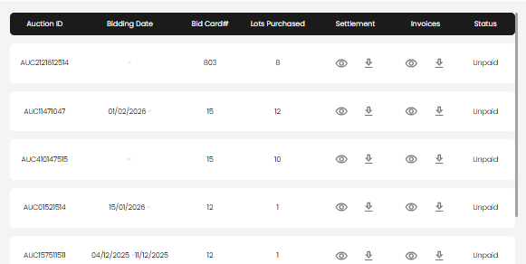

[Payment](index.md) · [Auction Journal](../../index.md)

# How do I view my payment invoices as a bidder?

You can view your auction payment invoices from your bidder dashboard at:

- `/bidder/invoices`

## Open the invoices page

1. Sign in to your bidder account.
2. From the left menu, select **Invoices**.
3. Or open the direct URL: `/bidder/invoices`.

## What you can see

Each row shows:

- Auction ID
- Bidding date range
- Bid Card#
- Lots purchased
- Settlement (view/download icons)
- Invoices (view/download icons)
- Status (for example: `Unpaid`)

*Invoices table with settlement/invoice view and download actions for each auction.*

## View or download documents

- Select the **eye icon** to open settlement or invoice PDF in a new tab.
- Select the **download icon** to download the settlement or invoice PDF.

## If nothing appears

- The page shows invoices linked to your auction settlements.
- If you have no eligible records yet, you will see a "No invoices found" message.
