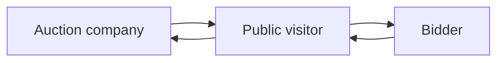

[Platform](./index.md) · [Auction Journal](../index.md)

# What is Auction Journal? Who should use it, and why?

**Auction Journal** is an online platform where **auction companies** run sales and **buyers** discover auctions, register, and bid. The same public website also lets anyone **browse** listings, auctions, blogs, and videos without signing in.

---

## What is Auction Journal?

Auction Journal brings together three main experiences:

| Part of the platform | Who uses it | What it is for |
|----------------------|-------------|----------------|
| **Public website** | Everyone (no account required to browse) | Find auctions, lots, listings, auctioneer profiles, blogs, and videos. |
| **Bidder account** | People who want to buy at sales | Register for auctions, bid when approved, manage profile, verification, and bidder dashboard activity. |
| **Auctioneer Dashboard** | Auction businesses and their staff | Create and run listings and auctions, manage lots, customers, clerking, settlement, content, and payments setup. |

An **auction** on Auction Journal is a structured sale event (timed online, live webcast, onsite, and other types the auctioneer offers) with **lots**, registration, bidding, and close-out. A **listing** is a separate way to advertise property or assets and capture bidder interest—it does not replace a full auction workflow, but many auctioneers use **both** for the same business.

Auction Journal is built for **U.S.-style auction operations**: auctioneer licensing and company details at signup, verified bidding where required, and tools for **onsite floor bidders** as well as **online bidders**.

---

## Who should use Auction Journal?

### Auction companies (auctioneers)

**You should use Auction Journal if** you run or support **live and online auctions** and want one place to:

- Publish **listings** and **auctions** so buyers can find you on the public site
- Build **catalogs** (lots), open **registration**, run **live** or **timed** bidding, **clerk** results, and handle **settlement**
- Keep **seller and buyer records** (customers), mailing lists, and floor bidders for your company
- Promote your brand with **blogs**, **videos**, and optional **advertisements**

Learn more: [Who is an auctioneer?](../auctioneeer/role.md) · [Register as an auctioneer](../auctioneeer/registration.md) · [Initial setup](../auctioneeer/initial-setup.md)

### Buyers (bidders)

**You should use Auction Journal if** you want to **participate in auctions** hosted on the platform—not if you are trying to run an auction house yourself (that requires an auctioneer account).

As a bidder you can search sales, **register for auctions**, place bids when the auctioneer approves you, use a **watchlist**, and manage verification and payment details when the sale or platform requires them.

Learn more: [Who is a bidder?](../bidder/role.md) · [Register as a bidder](../bidder/registration.md) · [Verified bidder](../bidder/verification.md)

### Visitors (no account)

**You should use the public site** when you only need to **look**—upcoming auctions, past results, listings, educational content, or an auctioneer’s profile—without bidding yet. You can create a bidder account later when you are ready to join a sale.

### Sellers working with an auctioneer

If you **consign goods** to an auction company, you usually work **through that auctioneer’s customer relationship**, not as a separate “seller signup” on Auction Journal. The auctioneer adds you as a **customer** (seller/consignor) and ties your items to lots and settlement. See [Who is a customer?](../auctioneer-client/add-customer.md).

### Team members at an auction company

Staff invited as **users (assistants)** use the Auctioneer Dashboard on behalf of the business—for example helping with catalogs and lots. See [Auctioneer users](../auctioneer-assistants/index.md).

---

## Why use Auction Journal?

### For auctioneers

| Benefit | What it means for you |
|---------|------------------------|
| **Reach more bidders** | Published auctions and listings appear on the public Auction Journal site where buyers search nationally. |
| **One workflow for the sale** | From catalog and registration through bidding, clerking, and settlement in the dashboard. |
| **Flexible sale formats** | Timed online bidding, onsite sales, live webcast, and related options—choose what fits each event ([auction types](../auction/auction-types.md)). |
| **Marketing beyond the catalog** | Listings for lead generation, blogs and videos for education and trust, ads for extra visibility ([advertisements](../advertisement/how-it-works.md)). |
| **Customer records in one place** | Sellers, online buyers, and floor bidders linked to your company ([customers](../auctioneer-client/index.md)). |
| **Payments and trust** | Stripe Connect and platform billing for publishing services; bidders can complete **verified bidder** steps when you need card-on-file and ID. |

### For bidders

| Benefit | What it means for you |
|---------|------------------------|
| **Discover sales in one marketplace** | Search auctions and lots across many auction houses. |
| **Clear path to bid** | Free bidder registration ([cost](../bidder/cost.md)); register per auction; bid after approval. |
| **Account tools** | Bidder dashboard for registrations, bids, watchlist, alerts, score history, and invoices when applicable. |
| **Verification when required** | One-time verified bidder setup for auctions that require it ([why verification matters](../bidder/verification-required.md)). |

### For everyone browsing

| Benefit | What it means for you |
|---------|------------------------|
| **Transparent discovery** | View sale details, terms, notices, and auctioneer information before you commit to register. |
| **Educational content** | Blogs and videos from auction professionals ([find videos](../video/find-videos.md), [find blogs](../blog/find-blogs.md)). |

---

## How the roles fit together

- The **auctioneer** runs the sale and sets the rules for that auction.
- The **bidder** registers and bids under those rules.
- The **public** can view published information without logging in.

Auctioneer accounts and bidder accounts are **different**. If you both run auctions and buy elsewhere, you need the appropriate account type for each role.

---

## Where to go next

| I want to… | Start here |
|------------|------------|
| Run auctions as a business | [Auctioneer registration](../auctioneeer/registration.md) → [Initial setup](../auctioneeer/initial-setup.md) |
| Bid on sales | [Bidder registration](../bidder/registration.md) |
| Get help | [Help and Support](../help-and-support/getting-help.md) |
| See all sample topics | [Questions](../sample_questions.md) |
