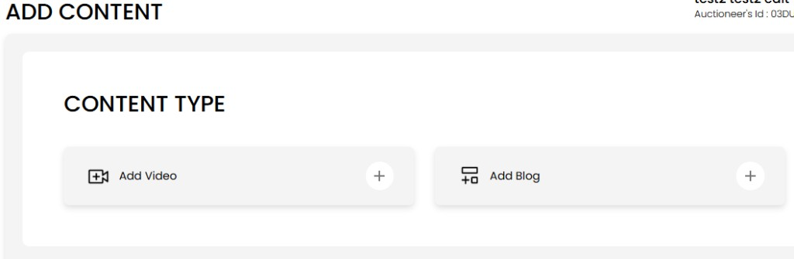
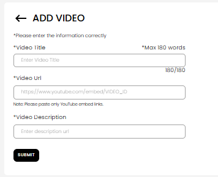

[Auction Journal](../index.md) · [Video](./index.md)

# How can an auctioneer add video content in Auction Journal?

Use the **Contents** area in the **Auctioneer Dashboard** to submit a video. Auction Journal does **not** host video files—you upload the video to **YouTube**, then paste the **YouTube embed link** into the form. After **Auction Journal** reviews and approves your submission, it can appear on [auctionjournal.com/videos](https://auctionjournal.com/videos). See [How do I find helpful videos?](../video/find-videos.md) for the public view.

---

## Before you start

- Sign in to the **Auctioneer Dashboard**.  
- Upload your video to a **YouTube** channel you control (public or unlisted, as YouTube allows embed).  
- Copy the **embed** URL (not a normal watch link).  
- New submissions are **not** on the public site until reviewed and **Published**.

---

## Step 1 — Open Add Content

1. In the left menu, open **Contents**.  
2. Select **ADD Content**.



---

## Step 2 — Choose Add Video

Under **CONTENT TYPE**, select **Add Video** (camera icon).

---

## Step 3 — Get your YouTube embed link

Auction Journal only accepts links in this form:

```text
https://www.youtube.com/embed/VIDEO_ID
```

Replace `VIDEO_ID` with the id from your YouTube video (usually 11 characters).

### On YouTube (desktop)

1. Open your video on [youtube.com](https://www.youtube.com).  
2. Select **Share** below the player.  
3. Select **Embed**.  
4. Copy the URL from the embed code. It looks like:

   `https://www.youtube.com/embed/AbCdEfGhIjk`

   You can paste **only that URL** into Auction Journal—not the full `<iframe>` HTML.

### What not to paste

| Link type | Works? |
|-----------|--------|
| `https://www.youtube.com/embed/VIDEO_ID` | Yes |
| `https://www.youtube.com/watch?v=VIDEO_ID` | No — use **Embed** and copy the embed URL |
| `https://youtu.be/VIDEO_ID` | No — convert to embed format above |

If the form shows a validation error, check that the link starts with `https://www.youtube.com/embed/` and matches your video id.

---

## Step 4 — Fill in the Add Video form



| Field | What to enter |
|-------|----------------|
| **Video Title** | Title shown on Auction Journal (within the max length shown). |
| **Video Url** | Paste your **YouTube embed** link. Note on the form: *Please paste only YouTube embed links.* |
| **Video Description** | Short description of what the video covers. |

Select **Submit**.

---

## Step 5 — After you submit

- A **success** message appears.  
- Open **Contents** → **View Content**, switch to **Videos**, and find your row.  
- Status **Unpublished** means it is still in review.  
- When status is **Published**, **View** opens the public **videos** page where visitors can watch it.

Submit confirmation text explains that your content was submitted and you will be notified after **review and publication**.

---

## Tips

- Record in advance, upload to YouTube, then submit the embed link—plan for review time before a sale.  
- **Posted by** on the public site shows your auction company name from your profile.  
- For written articles, use [Add blog content](../blog/add-content.md) instead.

---

## Related

- [How do I find helpful videos? (public)](../video/find-videos.md)  
- [How can I add blog content?](../blog/add-content.md)  
- [Does video appear immediately? What should I avoid?](approval-and-rejection.md)
