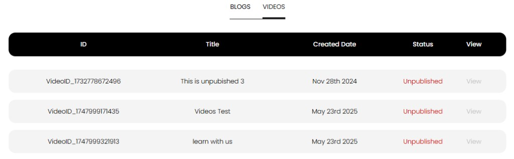

[Auction Journal](../index.md) · [Video](./index.md)

# Does video appear in Auction Journal immediately? What should I avoid in videos to prevent rejection?

**No.** A video you submit does **not** appear on [auctionjournal.com/videos](https://auctionjournal.com/videos) immediately. The **Auction Journal** team reviews it first. After **approval**, status becomes **Published** and the public can watch it on the **VIDEOS** page.

---

## When does my video appear publicly?

| Step | What happens |
|------|----------------|
| 1. You submit | Upload to **YouTube**, then **Contents** → **ADD Content** → **Add Video** → paste **embed** link → **Submit** ([how to add video](add-content.md)) |
| 2. Review | Status stays **Unpublished** while our team assesses it |
| 3. Approved | Status **Published** on **View Content** |
| 4. Live on the web | Visitors see it on [auctionjournal.com/videos](https://auctionjournal.com/videos) |

Submission confirmation states your content was received and will be **reviewed and published** when approved.

---

## How to check status

1. Sign in to the **Auctioneer Dashboard**.  
2. Open **Contents** → **View Content** (`/dashboard/view-content`).  
3. Select the **VIDEOS** tab.

| Status | Meaning |
|--------|---------|
| **Unpublished** (red) | In review or not approved—not on the public videos page |
| **Published** (green) | Approved—visible on the public site |

Use **View** when **Published** to open the public videos page. **View** is disabled while **Unpublished**.

---

## If it is not approved within about 5 days

If status is still **Unpublished** after **about 5 days**, contact **Help and Support** (**GET HELP** in the dashboard) and provide your **Video ID** from the table.

---

## What to avoid so your video is more likely to be approved

Videos are **not uploaded** to Auction Journal—you host on **YouTube** and give us an **embed** link only. Review checks the link, metadata, and whether the video is appropriate for public display.

### Required fields

- **Video Title**  
- **Video Url** — must be a valid **YouTube embed** URL  
- **Video Description**

### Technical mistakes (form may reject these)

| Mistake | Use instead |
|---------|-------------|
| `https://www.youtube.com/watch?v=VIDEO_ID` | **Share** → **Embed** on YouTube → copy `https://www.youtube.com/embed/VIDEO_ID` |
| `https://youtu.be/VIDEO_ID` | Same embed URL as above |
| Private YouTube video that cannot be embedded | YouTube visibility must allow **embed** on other sites |
| Broken or deleted YouTube video | Link must play when our team checks it |

See [How to get the embed link](add-content.md) in the add-video guide (Step 3).

### Content our team may not approve

| Avoid | Why |
|-------|-----|
| Placeholder titles or descriptions (“test video”, empty text) | Not useful for visitors |
| Off-topic, offensive, or misleading material | Public auction audience |
| Copyrighted footage you do not have rights to show | Policy and legal risk |
| Silent/black screen or broken recording | Poor experience on the public site |
| Unrelated advertising-only clips with no auction value | Content should help bidders or promote your auctions appropriately |

### Before you submit

- Confirm the embed URL plays in a private browser tab.  
- Write an accurate **description** of what the viewer will learn.  
- Use a professional title tied to your auction business.

---

## Related

- [How can I add video content?](add-content.md)  
- [How do visitors find videos?](../video/find-videos.md)  
- [Questions — Video](../sample_questions.md#video)
